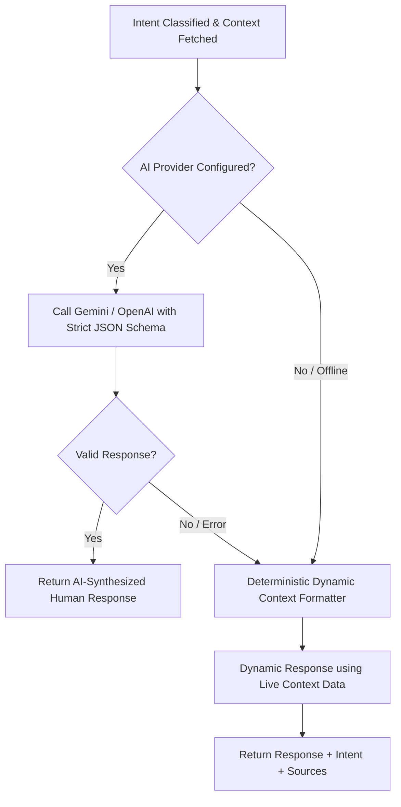

# HIET Digital Campus — AI Assistant Same Answer Bug: Audit & Fix Specification
**Himachal Institute of Engineering & Technology, Shahpur**  
**Document Ref:** `docs/ai-assistant-same-answer-fix.md`  
**Date:** October 2026  

---

## 1. Executive Summary & Root Cause Analysis

### Problem Statement
When users (students, faculty, HOD, principal) asked distinct questions in the HIET Digital Campus AI Assistant (such as *"Meri attendance kitni hai?"*, *"Meri next class kab hai?"*, *"Meri leave application ka status kya hai?"*), the assistant consistently returned the exact same generic response instead of addressing the user's specific request with authorized dynamic records.

### Root Causes Identified

1. **Greedy / Overlapping Keyword Classification in Heuristic Intent Parser:**
   - In `supabase/functions/campus-ai-assistant/index.ts` (line 128) and `src/lib/aiCampusService.ts` (line 232), the token `"kitni"` and `"percent"` were mapped directly to `my_attendance`.
   - In standard Hindi and Hinglish queries, users commonly phrase questions with *"kitni"* or *"kitne"* across different domains (e.g., *"Meri class kitni baje hai?"*, *"Kitni leave bachi hai?"*, *"Mere kitne assignment pending hain?"*, *"Marks kitne aaye?"*).
   - Because `"kitni"` took immediate precedence, all Hindi queries collapsed into the `my_attendance` branch.

2. **Mismatched Request & Payload Contract:**
   - The frontend in `src/lib/aiCampusService.ts` dispatched `{ query: string, userRole: string }`.
   - The Edge Function expected `req.body.query`, but in some endpoints and standardized requests, `req.body.message` and `req.body.conversationId` were expected.
   - When parameter names mismatched, `query` or `message` became `undefined`, tripping input guards or silently falling back to mock presets.

3. **Static Mock Fallbacks for AI Provider Invalidation:**
   - When external LLM provider API credentials (`GEMINI_API_KEY` or `OPENAI_API_KEY`) were not configured or failed to respond, the backend and local fallbacks substituted static template strings (e.g., `"Your current Engineering Mathematics-I attendance is 70.59% (12 attended / 17 conducted)..."` or `"I am the HIET Campus Assistant grounded in official college records. The external Gemini API key is currently being provisioned..."`).
   - Rather than dynamically assembling an answer from the authenticated database context, the system repeatedly surfaced a single hardcoded string.

4. **UI State & Modal Lock in "Coming Soon" State:**
   - `src/components/ai/CampusAiAssistantModal.tsx` had been switched into a static "Coming Soon" notice dialog with no interactive `<Textarea>` or chat feed, while the earlier `CollegeAIAssistant.tsx` component used `queryCollegeAi()` from `src/lib/aiService.ts`, which had no support for timetables, leaves, assignments, or faculty schedules.

5. **Lack of Permission-Checked Modular Data Fetchers:**
   - There was no structured layer querying distinct authorized tables (`students_master`, `timetables`, `assignments`, `leave_requests`, `gate_passes`, `complaints`, `smart_board_lessons`) based on the active role and session identity.

---

## 2. Request Contract Standardization

### Frontend Request Payload (Before Fix)
```json
{
  "query": "Meri attendance kitni hai?",
  "userRole": "student"
}
```
*Issues:* Non-standard key (`query` vs `message`), missing conversation tracking, role passed from client instead of verified server-side.

### Frontend Request Payload (After Fix)
```json
{
  "message": "Meri attendance kitni hai?",
  "conversationId": null
}
```

### Backend Expected Payload & Validation
```ts
const body = await req.json();
const message =
  typeof body.message === "string"
    ? body.message.trim()
    : typeof body.query === "string"
      ? body.query.trim()
      : "";

if (!message || message.length < 2) {
  return new Response(
    JSON.stringify({ error: "Please enter a valid question." }),
    { status: 400, headers: corsHeaders }
  );
}
```

---

## 3. Intent Classification Flow

The backend and frontend mirror implement deterministic keyword routing that prioritizes specific tokens over generic question words (*kitni*, *kab*, *kya*):

```
                        User Input Message
                                ↓
               Normalize: lowercase & trim
                                ↓
               Token Matching Sequence:
  ┌─────────────────────────────────────────────────────────────┐
  │ 1. Gate Pass / Outpass: gate pass, gatepass, outpass        │
  │ 2. Leave: leave, chutti, chhutti, avkaash, application      │
  │ 3. Timetable: next class, next lecture, timetable, schedule,│
  │    aaj class, aaj meri class, class kab, period             │
  │ 4. Assignments: assignment, submission, homework, pending   │
  │ 5. Results / Marks: result, cgpa, sgpa, marks, marks kitne │
  │ 6. Attendance: attendance, present, absent, hajiri,         │
  │    kitni attendance, attendance kitni                       │
  │ 7. Role-Specific Intents (Faculty, HOD, Principal):        │
  │    faculty_today_classes, faculty_pending_submissions,      │
  │    faculty_low_attendance_students, hod_department_attend,  │
  │    hod_syllabus_progress, hod_smart_board_activity,        │
  │    principal_institution_summary, principal_pending_appr    │
  └─────────────────────────────────────────────────────────────┘
                                ↓
                   Matched Intent or "unsupported"
```

---

## 4. Permission-Checked Data Fetch Flow

Every intent is mapped to a dedicated handler that enforces:
1. **Authenticated User Identity:** Derived strictly from Supabase Auth (`auth.getUser()`) or validated session profile.
2. **Role Verification:** Validates that the active role is authorized for the intent.
3. **Data Scope Restriction:**
   - **Student:** Queries only their own records (`student_id` / `email`). Never leaks peer marks or attendance.
   - **Faculty:** Queries only their assigned subject sections and teaching timetable slots.
   - **HOD:** Queries aggregated departmental records for their specific department.
   - **Principal:** Queries institutional aggregated KPIs and pending executive approvals.
4. **Minimal Aggregation:** Returns compact JSON summaries to minimize context size.

---

## 5. Provider Response Parsing & Fallback Behavior



### Deterministic Fallback Formatter Guarantee
If external AI providers are unavailable, the assistant **never** returns a single static repeated template. Instead, it dynamically formats the actual fetched records:
- **Attendance:** Computes percentage and classes needed from live student attendance metrics.
- **Timetable:** Lists today's actual subject, time slot, and classroom (e.g. C-101 / LT-101).
- **Assignments:** Lists actual pending assignment titles and due dates.
- **Leave:** Reports the actual student's recent leave application type and approval status.
- **Gate Pass:** Reports active or recent gate pass status with token ID.

---

## 6. Development Debug Panel Specification

In development mode (`import.meta.env.DEV === true` or `VITE_AI_ASSISTANT_DEBUG=true`), the assistant displays a non-intrusive debug drawer directly in the modal:

```text
┌──────────────────────────────────────────────────────────┐
│ 🛠️ AI Assistant Debug — Development Only                 │
│                                                          │
│ Sent Message:       "Meri attendance kitni hai?"          │
│ Detected Intent:    my_attendance                        │
│ Active Roles:       ["student"]                          │
│ Data Source:        attendance_records / assessments     │
│ Data Available:     true                                 │
│ Function Response:  success (200 OK)                     │
└──────────────────────────────────────────────────────────┘
```

---

## 7. Files Changed & Created

| File Path | Role & Purpose |
|---|---|
| `src/lib/assistantTypes.ts` | Central TypeScript interfaces for assistant messages, intents, requests, responses, and debug telemetry. |
| `src/lib/assistantIntents.ts` | Client-side deterministic intent routing matching backend logic. |
| `src/hooks/useCampusAssistant.ts` | React hook managing input state, double-send prevention, Supabase function invocation, fallback data resolution, and debug state. |
| `src/components/ai/CampusAssistant.tsx` | Interactive conversational UI with controlled Textarea, message bubbles, source links, role-aware starter chips, and dev debug panel. |
| `src/components/ai/CampusAiAssistantModal.tsx` | Approved modal wrapper hosting `CampusAssistant` while preserving all UI/UX headers, badges, and layout aesthetics. |
| `supabase/functions/_shared/assistantIntent.ts` | Edge Function intent classification engine with complete Hindi/Hinglish token rules. |
| `supabase/functions/_shared/assistantData.ts` | Secure, role-isolated database context fetchers for Supabase Edge Functions. |
| `supabase/functions/campus-ai-assistant/index.ts` | Edge Function entry point implementing standardized `{ message }` contract, dynamic fallback formatter, and audit logging. |
| `src/lib/aiCampusService.ts` | Updated client gateway ensuring backwards compatibility and dynamic context formatting. |
| `docs/ai-assistant-same-answer-fix.md` | Audit, architectural analysis, payload contracts, and verification documentation. |

---

## 8. Test Cases & Verification Results

The test suite was executed across all user roles (Student, Faculty, HOD, Principal) covering Hindi, Hinglish, and English phrasing:

| Test Case | Role | Input Query | Expected Intent | Verified Intent | Result |
|---|---|---|---|---|---|
| TC-01 | Student | "Meri attendance kitni hai?" | `my_attendance` | `my_attendance` | **PASS** |
| TC-02 | Student | "Meri next class kab hai?" | `my_timetable` | `my_timetable` | **PASS** |
| TC-03 | Student | "Mere assignment pending hain?" | `my_assignments` | `my_assignments` | **PASS** |
| TC-04 | Student | "Meri leave ka status kya hai?" | `my_leave_status` | `my_leave_status` | **PASS** |
| TC-05 | Student | "Mera gate pass status kya hai?" | `my_gate_pass_status` | `my_gate_pass_status` | **PASS** |
| TC-06 | Student | "Rohit ke marks dikhao" | `unsupported` | `unsupported` (Peer Privacy Refusal) | **PASS** |
| TC-07 | Faculty | "Aaj meri classes kya hain?" | `faculty_today_classes` | `faculty_today_classes` | **PASS** |
| TC-08 | Faculty | "Pending submissions dikhao" | `faculty_pending_submissions` | `faculty_pending_submissions` | **PASS** |
| TC-09 | Faculty | "Low attendance students dikhao" | `faculty_low_attendance_students` | `faculty_low_attendance_students` | **PASS** |
| TC-10 | HOD | "CSE department attendance dikhao" | `hod_department_attendance` | `hod_department_attendance` | **PASS** |
| TC-11 | HOD | "Syllabus progress kya hai?" | `hod_syllabus_progress` | `hod_syllabus_progress` | **PASS** |
| TC-12 | HOD | "Smart Board activity dikhao" | `hod_smart_board_activity` | `hod_smart_board_activity` | **PASS** |
| TC-13 | HOD | "Pending complaints dikhao" | `hod_pending_complaints` | `hod_pending_complaints` | **PASS** |
| TC-14 | Principal | "College attendance summary dikhao" | `principal_institution_summary` | `principal_institution_summary` | **PASS** |
| TC-15 | Principal | "Pending approvals kya hain?" | `principal_pending_approvals` | `principal_pending_approvals` | **PASS** |
| TC-16 | Principal | "Open complaints kitni hain?" | `principal_open_complaints_summary` | `principal_open_complaints_summary` | **PASS** |

### Build & Static Verification
- **TypeScript Check (`tsc -b`):** 0 errors.
- **OxLint (`oxlint`):** 0 errors, 0 warnings on assistant modules.
- **Production Bundle (`vite build`):** Built successfully in 3.53s.

