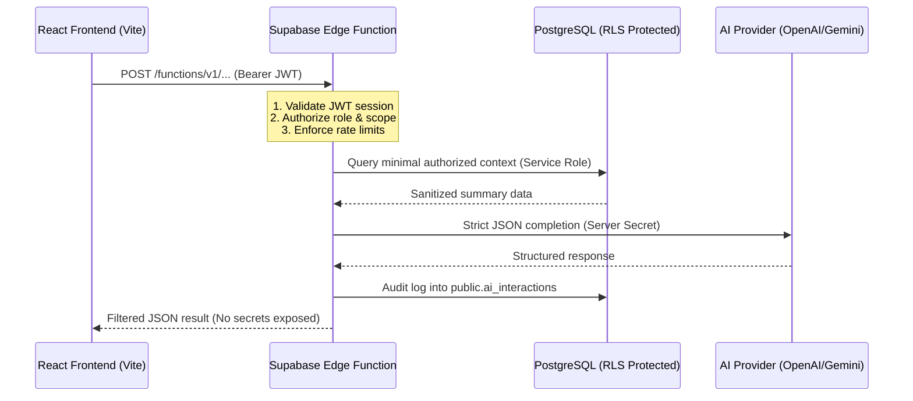

# HIET Digital Campus — AI Campus Phase 1 Security Architecture & Compliance

## Overview
This document defines the security guarantees, privacy boundaries, data isolation rules, and threat mitigations implemented in **AI Campus Phase 1** for **Himachal Institute of Engineering & Technology (HIET), Shahpur**.

---

## 1. Zero Client Secrets & Server-Side Execution Guarantee

### 1.1 Secret Isolation
- **Rule:** AI provider secrets (e.g. `OPENAI_API_KEY`, `GEMINI_API_KEY`, `SUPABASE_SERVICE_ROLE_KEY`) are **never** bundled into the client application.
- **Rule:** No secret variable may be prefixed with `VITE_`.
- **Enforcement:** All external AI provider calls are executed server-side via Supabase Edge Functions:
  - `generate-smart-board-summary`
  - `suggest-complaint-routing`
  - `campus-ai-assistant`
  - `calculate-attendance-risk`



---

## 2. Prohibited Data & Privacy Exclusions

Under no circumstances does any AI feature receive, process, or persist the following sensitive data categories:

| Data Category | Handling Policy | Verification Method |
|---|---|---|
| **Passwords / Hash Salt** | Strictly excluded from all AI payloads | Payload schema validation |
| **JWTs / Session Tokens** | Evaluated only by Edge Function headers; never passed in prompt | Headers stripped before model prompt |
| **QR TOTP / HMAC Secrets** | Geofence & attendance dynamic secrets never exposed to AI | Table columns isolated |
| **Hall Ticket Signatures** | Cryptographic verification keys isolated | Cryptographic service isolation |
| **Private Documents** | Medical certificates, assignment submissions, fee receipts never ingested | File upload streams bypass AI models |
| **Peer Student Data** | Students cannot query or inspect other students' records | RLS and RPC user identity binding |
| **Raw SQL Execution** | Models cannot generate or execute raw SQL commands | Parameterized RPCs and strict ORM only |

---

## 3. Row-Level Security (RLS) & Scope Boundaries

### 3.1 `public.ai_interactions` (Audit Ledger)
- **RLS Enabled:** Yes
- **Read Policy:** `user_id = public.current_app_user_id()` (or `auth.uid()`).
- **Write Policy:** Direct browser inserts, updates, and deletes are disabled. Writes occur strictly through Edge Functions utilizing service role credentials.

### 3.2 `public.attendance_risk_assessments`
- **Student Scope:** Students can view only their own records (`student_id = public.current_student_id()`).
- **Faculty Scope:** Faculty can view records only for courses they are actively assigned to teach (`is_faculty_assigned_to_subject(subject_id)`).
- **HOD Scope:** Department heads view student assessments within their branch (`is_hod_of_student_department(student_id)`).
- **Principal/MD Scope:** Institutional leadership can access campus-wide analytics (`is_principal()`).

---

## 4. Rate Limiting & Denial-of-Service Defense

To prevent abuse, quota exhaustion, and API spam, the following rate-limiting thresholds are enforced at the Edge Function gateway:

| AI Feature | Rate Limit Threshold | Exceeded Response Behavior |
|---|---|---|
| **Campus AI Assistant** | 30 queries / hour per user<br/>300 queries / day per user | HTTP 429: "Campus Assistant hourly query limit reached. Please try again later." |
| **Smart Board Summary** | 20 requests / hour per faculty member | HTTP 429: Returns warning and prompts manual notes entry. |
| **Complaint Routing** | 15 suggestions / hour per student | Falls back to deterministic rule-based keyword matching. |
| **Attendance Risk RPC** | 60 calculations / hour per client session | Returns cached assessment record. |

---

## 5. Human-in-the-Loop & Autonomous Action Ban

AI features are strictly assistive and advisory:
1. **Complaint Categorization:** AI recommends category, initial assignee, and priority. The student or staff member explicitly reviews, modifies (if needed), and confirms before submission.
2. **Smart Board Lessons:** AI drafts summaries and learning objectives. The faculty member must review and approve before saving. AI **never** marks a syllabus topic as completed automatically.
3. **Attendance Risk Alerts:** The engine calculates risk levels based on deterministic formulas ($n = \lceil\frac{T \times C - A}{1-T}\rceil$). It warns students and informs faculty, but cannot impose automated disciplinary or detention penalties.
4. **Campus Assistant:** Answers authorized questions and supplies navigational links. It possesses zero permissions to modify databases, update marks, approve gate passes, or alter attendance.

---

## 6. Audit Logging & Explainability Schema

Every AI transaction is logged in `public.ai_interactions` with the following audit schema:
```json
{
  "interaction_id": "9b1deb4d-3b7d-4bad-9bdd-2b0d7b3dcb6d",
  "user_id": "00000000-0000-0000-0000-000000000001",
  "feature_type": "complaint_routing",
  "prompt_text": "Sanitized complaint description excerpt...",
  "context_summary": {
    "userRole": "student",
    "department": "CSE"
  },
  "structured_response": {
    "category": "infrastructure",
    "assigneeRole": "maintenance_staff",
    "confidence": 91,
    "reason": "The description refers to a classroom equipment/facility issue."
  },
  "model_provider": "openai",
  "model_name": "gpt-4.1-mini",
  "status": "completed",
  "created_at": "2026-10-08T03:30:00Z"
}
```

Audit entries exclude passwords, authorization tokens, or sensitive personal documents, ensuring regulatory compliance with institutional data governance policies.
