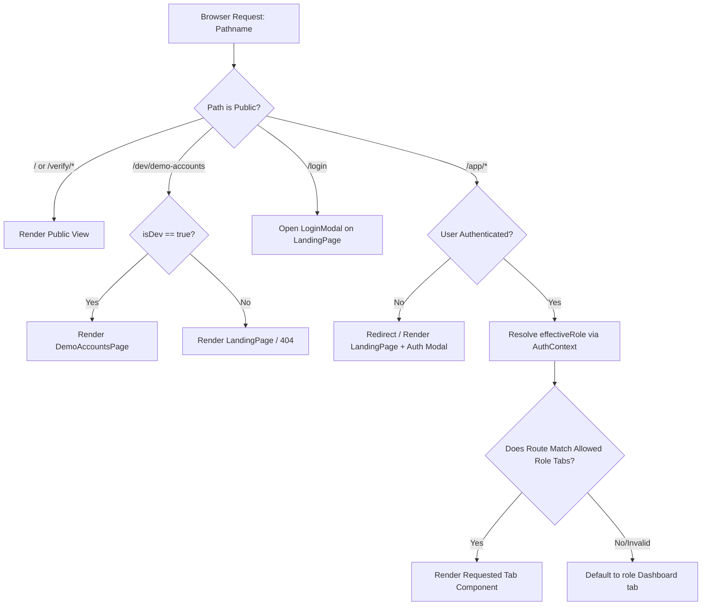

# HIET DIGITAL CAMPUS — ROUTE AND PAGE MAP
**Himachal Institute of Engineering & Technology, Shahpur (Kangra)**  
**Audit Date:** October 8, 2026 | **Auditor:** Automated Codebase Inspector

---

## 1. Architectural Routing Overview

Unlike traditional React applications utilizing `react-router-dom`, **HIET Digital Campus implements a zero-dependency lightweight custom routing synchronization architecture** directly embedded inside [src/App.tsx](file:///c:/Users/Shiv%20Pratap%20Singh/OneDrive/Desktop/college_help_desk/src/App.tsx).

### 1.1 How Routing Operates
1. **URL Synchronization Hook (`useEffect` in `App.tsx`):**  
   On application mount or URL change, the pathname (`window.location.pathname`) is parsed. If it starts with `/app/`, it strips role prefixes (e.g., `student`, `faculty`, `hod`, `principal`, `admin`, `security`, `md`, `warden`, `library`, `lab`, `it`) and maps the target segment to an internal active tab state (`currentTab: NavTab`).
2. **Sidebar & Tab Dispatch:**  
   Navigation clicks update `currentTab` and invoke `onSelectTab(tab)`. The active dashboard view for the authenticated role renders the corresponding sub-view or component based on `currentTab`.
3. **Public & Dev Intercepts:**  
   Specific top-level paths (`/login`, `/verify/hall-ticket/:token`, `/verify/certificate/:token`, `/dev/demo-accounts`) intercept the rendering pipeline before the authenticated layout.

---

## 2. Direct Browser Refresh & Hosting Configuration Audit

| Configuration File | Presence | Implementation Status | Direct Refresh Behavior |
|---|---|---|---|
| [`vercel.json`](file:///c:/Users/Shiv%20Pratap%20Singh/OneDrive/Desktop/college_help_desk/vercel.json) | **Present** | `{"rewrites": [{"source": "/(.*)", "destination": "/index.html"}]}` | **Works on Vercel**: Any nested path rewrites to `index.html`, where `App.tsx` reads `window.location.pathname` and restores the correct tab. |
| `public/_redirects` | **Missing** | Not present in [`public/`](file:///c:/Users/Shiv%20Pratap%20Singh/OneDrive/Desktop/college_help_desk/public) | **Would Fail on Netlify/Cloudflare Pages**: Direct refresh on nested route (`/app/attendance`) would yield HTTP 404 without a wildcard redirect rule (`/* /index.html 200`). |
| `netlify.toml` | **Missing** | Not present in root | Same as above. |
| Apache / Nginx Config | **Missing** | No server configs | Direct refresh requires fallback config on VPS / static servers. |

> [!IMPORTANT]  
> **Refresh Verdict:** Direct browser refresh on nested paths (e.g. `https://campus.hiet.ac.in/app/attendance` or `/app/student/attendance`) **works successfully on Vercel deployments** because `vercel.json` routes all requests to `index.html`. However, if the project is ever deployed to Netlify or standard static hosting, a `public/_redirects` file containing `/* /index.html 200` must be added to prevent 404 errors.

---

## 3. Comprehensive Route Inventory

### 3.1 Public Routes
| Route | Page Component | Protected? | Required Role(s) | Sidebar Link Exists? | Works/Status | Notes |
|---|---|---|---|---|---|---|
| `/` | [`LandingPage.tsx`](file:///c:/Users/Shiv%20Pratap%20Singh/OneDrive/Desktop/college_help_desk/src/views/LandingPage.tsx) | No | None (Public) | No | ✅ Fully Functional | Renders college hero, notice ticker, stats, quick action modals, footer. |
| `/verify/hall-ticket/:token` | [`VerifyPublicDoc.tsx`](file:///c:/Users/Shiv%20Pratap%20Singh/OneDrive/Desktop/college_help_desk/src/components/common/VerifyPublicDoc.tsx) | No | None (Public) | No | ✅ Fully Functional | Intercepted in `App.tsx:L120`. Calls RPC `rpc_verify_hall_ticket(p_verification_token)`. |
| `/verify/certificate/:token` | [`VerifyPublicDoc.tsx`](file:///c:/Users/Shiv%20Pratap%20Singh/OneDrive/Desktop/college_help_desk/src/components/common/VerifyPublicDoc.tsx) | No | None (Public) | No | ✅ Fully Functional | Intercepted in `App.tsx:L124`. Calls RPC `rpc_verify_event_certificate(p_verification_token)`. |

### 3.2 Authentication Routes
| Route | Page Component | Protected? | Required Role(s) | Sidebar Link Exists? | Works/Status | Notes |
|---|---|---|---|---|---|---|
| `/login` | [`LoginModal.tsx`](file:///c:/Users/Shiv%20Pratap%20Singh/OneDrive/Desktop/college_help_desk/src/components/auth/LoginModal.tsx) | No | None | No | ✅ Fully Functional | Automatically opens `LoginModal` over `LandingPage` if pathname is `/login`. Handles Email, Roll Number, and Employee Code. |

### 3.3 Student Routes (`effectiveRole === 'student'`)
Container: [`StudentDashboard.tsx`](file:///c:/Users/Shiv%20Pratap%20Singh/OneDrive/Desktop/college_help_desk/src/views/StudentDashboard.tsx)
| Route | Tab ID / Sub-Component | Protected? | Required Role(s) | Sidebar Link Exists? | Works/Status | Notes |
|---|---|---|---|---|---|---|
| `/app/dashboard` or `/app/student/dashboard` | `dashboard` | Yes | `student` | Yes (`Overview`) | ✅ Fully Functional | Student metrics, timetable banner, quick attendance, notices. |
| `/app/attendance` or `/app/student/attendance` | `attendance` (`StudentAttendanceView`) | Yes | `student` | Yes (`Attendance`) | ✅ Fully Functional | Overall %, subject attendance cards, logs, low attendance alerts, QR scan modal. |
| `/app/timetable` or `/app/student/timetable` | `timetable` (`TimetableView`) | Yes | `student` | Yes (`Timetable`) | ✅ Fully Functional | Weekly grid, current lecture countdown, room/faculty tags. |
| `/app/syllabus` or `/app/student/syllabus` | `syllabus` (`SyllabusView`) | Yes | `student` | Yes (`Syllabus`) | ✅ Fully Functional | Course units, PDF download links, completion status. |
| `/app/pyqs` or `/app/student/pyqs` | `pyqs` (`PYQsView`) | Yes | `student` | Yes (`PYQs`) | ✅ Fully Functional | Filter by semester, year, subject; download past exam papers. |
| `/app/assignments` or `/app/student/assignments` | `assignments` (`AssignmentsView`) | Yes | `student` | Yes (`Assignments`) | ✅ Fully Functional | Active assignment list, deadline badges, submission modal. |
| `/app/results` or `/app/student/results` | `cgpa` (`StudentResultsView`) | Yes | `student` | Yes (`Results`) | ✅ Fully Functional | Semester SGPA/CGPA cards, grade distribution. |
| `/app/sessional-marks` or `/app/student/sessional-marks` | `sessional_results` (`StudentSessionalMarksView`) | Yes | `student` | Yes (`Sessional Marks`) | ✅ Fully Functional | Mid-term sessional marks breakdown by subject. |
| `/app/leave` or `/app/student/leave` | `leaves` (`StudentLeaveView`) | Yes | `student` | Yes (`Leave`) | ✅ Fully Functional | Apply leave form, leave history, real-time approval timeline. |
| `/app/complaints` or `/app/student/complaints` | `complaints` (`StudentComplaintsView`) | Yes | `student` | Yes (`Complaint Box`) | ✅ Fully Functional | Grievance lodging, category selection, resolution tracking. |
| `/app/doubts` or `/app/student/doubts` | `doubts` (`StudentDoubtsView`) | Yes | `student` | Yes (`Doubt Box`) | ✅ Fully Functional | Ask subject faculty doubts, view replies, status badges. |
| `/app/achievements` or `/app/student/achievements` | `achievements` (`StudentAchievementsView`) | Yes | `student` | Yes (`Achievements`) | ✅ Fully Functional | Submit awards/certs, faculty verification status indicator. |
| `/app/gate-pass` or `/app/student/gate-pass` | `gate_pass` (`StudentGatePassView`) | Yes | `student` | Yes (`Gate Pass`) | ✅ Fully Functional | Apply day outpass, dynamic QR pass with security PIN. |
| `/app/hostel-outpass` or `/app/student/hostel-outpass` | `hostel_outpass` (`StudentHostelOutpassView`) | Yes | `student` | Yes (`Hostel Outpass`) | ✅ Fully Functional | Overnight outpass request, parent consent, warden approval status. |
| `/app/presence` or `/app/student/presence` | `campus_presence` (`StudentPresenceView`) | Yes | `student` | Yes (`Campus Presence`) | ✅ Fully Functional | Check-in at campus zones via QR, active presence status. |
| `/app/calendar` or `/app/student/calendar` | `calendar` (`CollegeCalendarView`) | Yes | `student` | Yes (`Calendar`) | ✅ Fully Functional | Academic schedule, exams, holidays, college events. |
| `/app/gallery` or `/app/student/gallery` | `gallery` (`CampusGalleryView`) | Yes | `student` | Yes (`Gallery`) | ✅ Fully Functional | Filter campus life photo albums and events. |
| `/app/notifications` or `/app/student/notifications` | `notices` (`NotificationsView`) | Yes | `student` | Yes (`Notifications`) | ✅ Fully Functional | Notification center, mark as read, category filters. |
| `/app/settings` or `/app/student/settings` | `settings` (`SettingsView`) | Yes | `student` | Yes (`Settings`) | ✅ Fully Functional | Profile summary, theme selector, change password trigger. |

### 3.4 Faculty Routes (`effectiveRole === 'faculty' | 'teacher'`)
Container: [`TeacherDashboard.tsx`](file:///c:/Users/Shiv%20Pratap%20Singh/OneDrive/Desktop/college_help_desk/src/views/TeacherDashboard.tsx)
| Route | Tab ID / Sub-Component | Protected? | Required Role(s) | Sidebar Link Exists? | Works/Status | Notes |
|---|---|---|---|---|---|---|
| `/app/dashboard` or `/app/faculty/dashboard` | `dashboard` | Yes | `faculty`, `teacher` | Yes (`Overview`) | ✅ Fully Functional | Teacher schedule, active classes, pending grading, recent doubts. |
| `/app/timetable` or `/app/faculty/timetable` | `timetable` | Yes | `faculty`, `teacher` | Yes (`My Timetable`) | ✅ Fully Functional | Faculty schedule filtered by assigned subjects and classes. |
| `/app/attendance` or `/app/faculty/attendance` | `attendance` (`AttendanceSessionModal`) | Yes | `faculty`, `teacher` | Yes (`Attendance`) | ✅ Fully Functional | Create session, dynamic QR code modal with 15s refresh, manual override table. |
| `/app/assignments` or `/app/faculty/assignments` | `assignments` | Yes | `faculty`, `teacher` | Yes (`Assignments`) | ✅ Fully Functional | Create new assignments, set deadlines, attach documents. |
| `/app/submissions` or `/app/faculty/submissions` | `submissions` | Yes | `faculty`, `teacher` | Yes (`Submissions`) | ✅ Fully Functional | View student submissions, grade entry, feedback text. |
| `/app/syllabus` or `/app/faculty/syllabus` | `syllabus` | Yes | `faculty`, `teacher` | Yes (`Syllabus`) | ✅ Fully Functional | Mark syllabus unit coverage, update topic status. |
| `/app/pyqs` or `/app/faculty/pyqs` | `pyqs` | Yes | `faculty`, `teacher` | Yes (`PYQs`) | ✅ Fully Functional | Upload past question papers to public repo. |
| `/app/sessional-marks` or `/app/faculty/sessional-marks` | `sessional_results` | Yes | `faculty`, `teacher` | Yes (`Sessional Marks`) | ✅ Fully Functional | Batch enter MST-1, MST-2, and assignment marks. |
| `/app/doubts` or `/app/faculty/doubts` | `doubts` | Yes | `faculty`, `teacher` | Yes (`Doubts`) | ✅ Fully Functional | Answer student academic questions with file attachments. |
| `/app/leave` or `/app/faculty/leave` | `leaves` | Yes | `faculty`, `teacher` | Yes (`Leave Requests`) | ✅ Fully Functional | Class In-charge review and approval of student leaves. |
| `/app/achievements` or `/app/faculty/achievements` | `achievements` | Yes | `faculty`, `teacher` | Yes (`Achievements`) | ✅ Fully Functional | Verify or reject student co-curricular submissions. |
| `/app/smart-board` or `/app/faculty/smart-board` | `smartboard` (`SmartBoardView`) | Yes | `faculty`, `teacher` | Yes (`Smart Board Lessons`) | ✅ Fully Functional | Create lessons, log slides/PDFs, sync to syllabus units. |
| `/app/notifications` or `/app/faculty/notifications` | `notices` | Yes | `faculty`, `teacher` | Yes (`Notifications`) | ✅ Fully Functional | Broadcasts and department announcements. |
| `/app/settings` or `/app/faculty/settings` | `settings` | Yes | `faculty`, `teacher` | Yes (`Settings`) | ✅ Fully Functional | Faculty profile, preferences, password management. |

### 3.5 Head of Department Routes (`effectiveRole === 'hod'`)
Container: [`HodDashboard.tsx`](file:///c:/Users/Shiv%20Pratap%20Singh/OneDrive/Desktop/college_help_desk/src/views/HodDashboard.tsx)
| Route | Tab ID / Sub-Component | Protected? | Required Role(s) | Sidebar Link Exists? | Works/Status | Notes |
|---|---|---|---|---|---|---|
| `/app/dashboard` or `/app/hod/dashboard` | `dashboard` | Yes | `hod` | Yes (`Overview`) | ✅ Fully Functional | Department KPIs, faculty count, student attendance rate, open complaints. |
| `/app/students` or `/app/hod/students` | `students_mgmt` | Yes | `hod` | Yes (`Students`) | ✅ Fully Functional | Department student directory filtered by HOD's department. |
| `/app/faculty` or `/app/hod/faculty` | `teachers_mgmt` | Yes | `hod` | Yes (`Faculty`) | ✅ Fully Functional | Department faculty directory and workload distribution. |
| `/app/academic-catalog` or `/app/hod/academic-catalog` | `academic_catalog` | Yes | `hod` | Yes (`Subject Allocation`) | ✅ Fully Functional | Map teachers to subjects for the current semester. |
| `/app/timetable` or `/app/hod/timetable` | `timetable` | Yes | `hod` | Yes (`Timetable`) | ✅ Fully Functional | Master department class timetable matrix. |
| `/app/attendance` or `/app/hod/attendance` | `attendance` | Yes | `hod` | Yes (`Attendance`) | ✅ Fully Functional | Department attendance metrics & low attendance student filter (<75%). |
| `/app/results` or `/app/hod/results` | `sessional_results` | Yes | `hod` | Yes (`Academic Performance`) | ✅ Fully Functional | Department-wide performance graphs and pass/fail statistics. |
| `/app/syllabus-progress` or `/app/hod/syllabus-progress` | `syllabus_progress` | Yes | `hod` | Yes (`Syllabus Progress`) | ✅ Fully Functional | Track curriculum completion by subject and faculty. |
| `/app/smart-board` or `/app/hod/smart-board` | `smartboard` | Yes | `hod` | Yes (`Smart Board Activity`) | ✅ Fully Functional | Review department digital classroom utilization logs. |
| `/app/assignments` or `/app/hod/assignments` | `assignments` | Yes | `hod` | Yes (`Assignments`) | ✅ Fully Functional | Department assignment audit and submission statistics. |
| `/app/pyqs` or `/app/hod/pyqs` | `pyqs` | Yes | `hod` | Yes (`PYQs`) | ✅ Fully Functional | Approve and manage department question banks. |
| `/app/approvals` or `/app/hod/approvals` | `leaves` | Yes | `hod` | Yes (`Approvals`) | ✅ Fully Functional | Tier-2 escalation approval for student leaves and passes. |
| `/app/complaints` or `/app/hod/complaints` | `complaints` | Yes | `hod` | Yes (`Complaints`) | ✅ Fully Functional | Resolve student/faculty departmental grievances. |
| `/app/reports` or `/app/hod/reports` | `reports` | Yes | `hod` | Yes (`Reports`) | ✅ Fully Functional | Generate exportable departmental audit reports. |
| `/app/analytics` or `/app/hod/analytics` | `principal_analytics` | Yes | `hod` | Yes (`Analytics`) | ✅ Fully Functional | Departmental trend analysis and engagement charts. |
| `/app/notifications` or `/app/hod/notifications` | `notices` | Yes | `hod` | Yes (`Notifications`) | ✅ Fully Functional | Department notice board and notifications. |
| `/app/settings` or `/app/hod/settings` | `settings` | Yes | `hod` | Yes (`Settings`) | ✅ Fully Functional | HOD account settings. |

### 3.6 Principal & Administrator Routes (`effectiveRole === 'principal' | 'admin'`)
Container: [`PrincipalDashboard.tsx`](file:///c:/Users/Shiv%20Pratap%20Singh/OneDrive/Desktop/college_help_desk/src/views/PrincipalDashboard.tsx)
| Route | Tab ID / Sub-Component | Protected? | Required Role(s) | Sidebar Link Exists? | Works/Status | Notes |
|---|---|---|---|---|---|---|
| `/app/dashboard` or `/app/principal/dashboard` | `dashboard` | Yes | `principal`, `admin` | Yes (`Overview`) | ✅ Fully Functional | College-wide metrics (admissions, attendance, faculty, complaints). |
| `/app/students` or `/app/principal/students` | `students_mgmt` | Yes | `principal`, `admin` | Yes (`Students`) | ✅ Fully Functional | College-wide student directory with branch and batch filters. |
| `/app/faculty` or `/app/principal/faculty` | `teachers_mgmt` | Yes | `principal`, `admin` | Yes (`Faculty`) | ✅ Fully Functional | College-wide faculty directory with designation and workload. |
| `/app/departments` or `/app/principal/departments` | `department` | Yes | `principal`, `admin` | Yes (`Departments`) | ✅ Fully Functional | Department management and HOD appointment modal. |
| `/app/academic-catalog` or `/app/principal/academic-catalog` | `academic_catalog` | Yes | `principal`, `admin` | Yes (`Academic Catalog`) | ✅ Fully Functional | Institution branches, semesters, syllabus curriculum catalog. |
| `/app/timetable` or `/app/principal/timetable` | `timetable` | Yes | `principal`, `admin` | Yes (`Timetable`) | ✅ Fully Functional | Institution-wide timetable view across all departments. |
| `/app/attendance` or `/app/principal/attendance` | `attendance` | Yes | `principal`, `admin` | Yes (`Attendance`) | ✅ Fully Functional | Cross-department attendance comparison & low attendance tracking. |
| `/app/results` or `/app/principal/results` | `cgpa` | Yes | `principal`, `admin` | Yes (`Results`) | ✅ Fully Functional | University semester results summary and toppers list. |
| `/app/sessional-marks` or `/app/principal/sessional-marks` | `sessional_results` | Yes | `principal`, `admin` | Yes (`Sessional Marks`) | ✅ Fully Functional | Mid-term academic performance audit across branches. |
| `/app/syllabus-progress` or `/app/principal/syllabus-progress` | `syllabus_progress` | Yes | `principal`, `admin` | Yes (`Syllabus Progress`) | ✅ Fully Functional | Macro view of academic completion percentage across departments. |
| `/app/smart-board` or `/app/principal/smart-board` | `smartboard` | Yes | `principal`, `admin` | Yes (`Smart Board Activity`) | ✅ Fully Functional | Campus-wide digital classroom usage analytics. |
| `/app/leave` or `/app/principal/leave` | `leaves` | Yes | `principal`, `admin` | Yes (`Leave Requests`) | ✅ Fully Functional | Executive monitoring of student and faculty leaves. |
| `/app/complaints` or `/app/principal/complaints` | `complaints` | Yes | `principal`, `admin` | Yes (`Complaints`) | ✅ Fully Functional | Institutional grievance escalation queue. |
| `/app/operations` or `/app/principal/operations` | `gate_pass` | Yes | `principal`, `admin` | Yes (`Gate & Hostel Operations`) | ✅ Fully Functional | Institutional overview of entry/exit and outpass activity. |
| `/app/no-dues` or `/app/principal/no-dues` | `no_dues` | Yes | `principal`, `admin` | Yes (`No-Dues & Hall Tickets`) | ✅ Fully Functional | Clearance workflows across library, labs, hostel; hall ticket issues. |
| `/app/events` or `/app/principal/events` | `events` | Yes | `principal`, `admin` | Yes (`Events & Certificates`) | ✅ Fully Functional | Create college fests, workshops, issue verifiable certificates. |
| `/app/import` or `/app/principal/import` | `import_data` | Yes | `principal`, `admin` | Yes (`Master Data Import`) | ✅ Fully Functional | Batch CSV/JSON student/faculty import with dry-run and error logging. |
| `/app/reports` or `/app/principal/reports` | `reports` | Yes | `principal`, `admin` | Yes (`Reports`) | ✅ Fully Functional | Executive CSV/PDF exportable reports. |
| `/app/content` or `/app/principal/content` | `notices` | Yes | `principal`, `admin` | Yes (`Content`) | ✅ Fully Functional | Post official college notices, circulars, and gallery updates. |
| `/app/analytics` or `/app/principal/analytics` | `principal_analytics` | Yes | `principal`, `admin` | Yes (`Analytics`) | ✅ Fully Functional | Strategic charts on attendance, admissions, grievances. |
| `/app/audit-log` or `/app/principal/audit-log` | `audit_log` | Yes | `principal`, `admin` | Yes (`Audit Log`) | ✅ Fully Functional | Tamper-evident log of administrative actions. |
| `/app/settings` or `/app/principal/settings` | `settings` | Yes | `principal`, `admin` | Yes (`Settings`) | ✅ Fully Functional | College system configuration and preferences. |

### 3.7 Managing Director Routes (`effectiveRole === 'managing_director' | 'md'`)
Container: [`ManagingDirectorDashboard.tsx`](file:///c:/Users/Shiv%20Pratap%20Singh/OneDrive/Desktop/college_help_desk/src/views/ManagingDirectorDashboard.tsx)
| Route | Tab ID / Sub-Component | Protected? | Required Role(s) | Sidebar Link Exists? | Works/Status | Notes |
|---|---|---|---|---|---|---|
| `/app/dashboard` or `/app/md/dashboard` | `dashboard` | Yes | `managing_director`, `md` | Yes (`Overview`) | ✅ Fully Functional | High-level executive overview, institutional enrollment, financial indicators. |
| `/app/analytics` or `/app/md/analytics` | `principal_analytics` | Yes | `managing_director`, `md` | Yes (`Institutional Analytics`) | ✅ Fully Functional | Long-term performance, student retention, faculty productivity. |
| `/app/departments` or `/app/md/departments` | `department` | Yes | `managing_director`, `md` | Yes (`Departments`) | ✅ Fully Functional | Departmental overview and executive metrics. |
| `/app/reports` or `/app/md/reports` | `reports` | Yes | `managing_director`, `md` | Yes (`Executive Reports`) | ✅ Fully Functional | Comprehensive operational reports. |
| `/app/presence` or `/app/md/presence` | `campus_presence` | Yes | `managing_director`, `md` | Yes (`Campus Presence`) | ✅ Fully Functional | Live headcount across campus buildings and gates. |
| `/app/audit-log` or `/app/md/audit-log` | `audit_log` | Yes | `managing_director`, `md` | Yes (`Audit Log`) | ✅ Fully Functional | High-level system activity inspection. |
| `/app/notifications` or `/app/md/notifications` | `notices` | Yes | `managing_director`, `md` | Yes (`Notifications`) | ✅ Fully Functional | Executive circulars and broadcast communications. |
| `/app/settings` or `/app/md/settings` | `settings` | Yes | `managing_director`, `md` | Yes (`Settings`) | ✅ Fully Functional | Profile and visual preferences. |

### 3.8 Security & Staff Routes (`security`, `warden`, `library_staff`, `lab_staff`, `it_staff`)
Containers: [`SecurityDashboard.tsx`](file:///c:/Users/Shiv%20Pratap%20Singh/OneDrive/Desktop/college_help_desk/src/views/SecurityDashboard.tsx) & [`PrincipalDashboard.tsx`](file:///c:/Users/Shiv%20Pratap%20Singh/OneDrive/Desktop/college_help_desk/src/views/PrincipalDashboard.tsx)
| Route | Tab ID / View | Protected? | Required Role(s) | Sidebar Link Exists? | Works/Status | Notes |
|---|---|---|---|---|---|---|
| `/app/scan` | `gate_scanner` | Yes | `security`, `security_guard` | Yes (`QR Scanner`) | ✅ Fully Functional | Real-time QR code camera scanner for student gate passes & outpasses. |
| `/app/gate-pass` | `gate_pass` | Yes | `security`, `warden` | Yes (`Gate Passes`) | ✅ Fully Functional | Validate and verify student exit authorization. |
| `/app/hostel-outpass` | `hostel_outpass` | Yes | `security`, `warden` | Yes (`Hostel Outpasses`) | ✅ Fully Functional | Log student return times and flag overdue hostel residents. |
| `/app/entry-exit-logs` | `reconciliation` | Yes | `security` | Yes (`Entry/Exit Logs`) | ✅ Fully Functional | Chronological movement log across main gate. |
| `/app/presence` | `campus_presence` | Yes | `security`, `warden` | Yes (`Campus Presence`) | ✅ Fully Functional | Track presence count by gate and zone. |
| `/app/security-alerts` | `fines` | Yes | `security` | Yes (`Security Alerts`) | ✅ Fully Functional | Late arrival notifications and disciplinary incident logs. |
| `/app/no-dues` | `no_dues` | Yes | `library_staff`, `warden`, `lab_staff` | Yes (`Clearance`) | ✅ Fully Functional | Clear student dues in respective departments. |
| `/app/maintenance` | `maintenance` | Yes | `lab_staff`, `it_staff` | Yes (`Equipment & Tickets`) | ✅ Fully Functional | Log equipment breakdown and update ticket resolution status. |

### 3.9 Development & Fallback Routes
| Route | Page Component | Protected? | Required Role(s) | Sidebar Link Exists? | Works/Status | Notes |
|---|---|---|---|---|---|---|
| `/dev/demo-accounts` | [`DemoAccountsPage.tsx`](file:///c:/Users/Shiv%20Pratap%20Singh/OneDrive/Desktop/college_help_desk/src/pages/dev/DemoAccountsPage.tsx) | No (Dev only) | Public in DEV (`import.meta.env.DEV`) | No | ✅ Fully Functional | One-click instant login switcher for all 15 institutional demo accounts. Disabled in production builds. |
| Any unknown route | `LandingPage.tsx` or Fallback Dashboard | No | Fallback | No | ✅ Fully Functional | Fallback logic renders the default tab (`dashboard`) or landing page for unauthenticated users. |

---

## 4. Route Protection & Role Escalation Verification

### Key Security Findings:
1. **Server-Side Authorization (Supabase RLS):** Route-level switching in `App.tsx` controls only which React view is mounted. Even if a malicious user manipulates client state to mount the `PrincipalDashboard`, all underlying database queries and mutations fail automatically because Supabase RLS enforces permissions based on `auth.uid()` and verified `user_roles`.
2. **Dev Preview Mode:** `?previewRole=` URL query parameter is strictly gated behind `import.meta.env.DEV`. In production bundles, `import.meta.env.DEV` evaluates to `false`, neutralizing any dev preview parameter tampering.
