# HIET DIGITAL CAMPUS — DATABASE SCHEMA MAP
**Himachal Institute of Engineering & Technology, Shahpur (Kangra)**  
**Audit Date:** October 8, 2026 | **Schema Source:** `supabase/migrations/` (38 migration files)

---

## 1. Schema Overview

The HIET Digital Campus database is structured into **50 distinct relational tables** supporting multi-role academic administration, real-time geofenced attendance, continuous evaluation, grievance resolution, digital classroom tracking, gate security, and verifiable institutional credentials.

- **PostgreSQL Extension Enabled:** `pgcrypto`, `uuid-ossp`
- **Total Tables Audited:** 50
- **Tables with Row Level Security (RLS) Enabled:** 50 (100% of public tables)
- **Primary Migration Enforcer:** [`20261007000023_enable_rls.sql`](file:///c:/Users/Shiv%20Pratap%20Singh/OneDrive/Desktop/college_help_desk/supabase/migrations/20261007000023_enable_rls.sql) and [`20261008000001_multi_role_and_workspaces.sql`](file:///c:/Users/Shiv%20Pratap%20Singh/OneDrive/Desktop/college_help_desk/supabase/migrations/20261008000001_multi_role_and_workspaces.sql)

---

## 2. Comprehensive Table Inventory

| Table Name | Primary Purpose | Primary Key | Key Foreign Keys | RLS Enabled? | Used By Feature(s) | Demo Seed Data? | Notes |
|---|---|---|---|---|---|---|---|
| `users` | Core user identity & profile | `id` (UUID) | Matches `auth.users(id)` | ✅ Yes | All modules, login, profile | ✅ Yes (15+ accounts) | Contains role, email, phone, is_active flag. |
| `app_roles` | Institutional role dictionary | `role_id` (UUID) | None | ✅ Yes | Multi-role RBAC, AuthContext | ✅ Yes (15 roles) | Pre-seeded with 15 hierarchical roles. |
| `user_roles` | User-to-role assignment map | `user_role_id` (UUID) | `user_id` → `users(id)`, `role_id` → `app_roles(role_id)`, `department_id` → `departments(id)` | ✅ Yes | Multi-role RBAC, Workspace Switcher | ✅ Yes | Supports scoped roles (e.g. HOD scoped to CSE). |
| `user_workspace_preferences` | Active role workspace state | `user_id` (UUID) | `user_id` → `users(id)`, `active_department_id` → `departments(id)` | ✅ Yes | Workspace Switcher | ✅ Yes | Persists whether Faculty is viewing HOD workspace. |
| `departments` | Academic departments | `id` (UUID) | None | ✅ Yes | All modules, filters, directory | ✅ Yes (CSE, ECE, ME, CE, EE, ASH) | Engineering branches with codes & descriptions. |
| `department_hod_assignments` | Formal HOD appointments | `assignment_id` (UUID) | `department_id` → `departments(id)`, `faculty_user_id` → `users(id)` | ✅ Yes | Principal HOD assignment modal | ✅ Yes | Contains active status, appointment remarks, dates. |
| `students_master` | Enrolled student records | `id` (UUID) | `user_id` → `users(id)`, `department_id` → `departments(id)` | ✅ Yes | Student directory, attendance, marks | ✅ Yes (6 demo students) | University roll number, batch year, section, email. |
| `teachers_master` | Faculty & staff directory | `id` (UUID) | `user_id` → `users(id)`, `department_id` → `departments(id)` | ✅ Yes | Faculty directory, assignments, doubts | ✅ Yes (6 demo teachers) | Employee code, designation, qualification, HOD flag. |
| `subjects` | Course curriculum catalog | `id` (UUID) | `department_id` → `departments(id)` | ✅ Yes | Timetable, attendance, syllabus | ✅ Yes (12+ subjects) | Course code, credits, semester, subject type. |
| `subject_assignments` | Teacher-subject mappings | `id` (UUID) | `faculty_id` → `teachers_master(id)`, `subject_id` → `subjects(id)` | ✅ Yes | Faculty timetable, attendance session | ✅ Yes | Assigns teacher to subject, semester, section. |
| `timetables` | Weekly period schedule | `id` (UUID) | `department_id` → `departments(id)`, `subject_id` → `subjects(id)`, `teacher_id` → `teachers_master(id)` | ✅ Yes | Student/Faculty Timetable view | ✅ Yes | Day of week, period number, start/end time, room. |
| `attendance_sessions` | Faculty attendance sessions | `id` (UUID) | `teacher_id` → `users(id)`, `subject_id` → `subjects(id)`, `department_id` → `departments(id)` | ✅ Yes | Dynamic QR attendance, geofencing | ✅ Yes | Stores rotating QR hash, GPS coords, 30m radius. |
| `attendance_records` / `attendance_logs` | Student attendance scans | `id` (UUID) | `session_id` → `attendance_sessions(id)`, `student_id` → `students_master(id)` | ✅ Yes | Attendance history, logs, analytics | ✅ Yes | Scan timestamp, GPS coords, verification method. |
| `syllabus` | Subject unit breakdowns | `id` (UUID) | `subject_id` → `subjects(id)` | ✅ Yes | Syllabus progress, units view | ✅ Yes | Unit number, title, description, estimated hours. |
| `pyqs` | Past exam question papers | `id` (UUID) | `subject_id` → `subjects(id)`, `uploaded_by` → `users(id)` | ✅ Yes | PYQ download & upload | ✅ Yes | Year, exam type (MST/Final), semester, file URL. |
| `assignments` | Faculty coursework assignments | `id` (UUID) | `teacher_id` → `users(id)`, `subject_id` → `subjects(id)` | ✅ Yes | Assignment creation & view | ✅ Yes (5 assignments) | Title, description, due date, max marks, PDF attachment. |
| `assignment_submissions` | Student assignment work | `id` (UUID) | `assignment_id` → `assignments(id)`, `student_id` → `students_master(id)` | ✅ Yes | Submission modal, grading modal | ✅ Yes | Submitted file URL, marks obtained, faculty feedback. |
| `sessional_marks` | Internal examination marks | `id` (UUID) | `student_id` → `students_master(id)`, `subject_id` → `subjects(id)` | ✅ Yes | Sessional marks entry & view | ✅ Yes | Exam type (MST-1, MST-2), marks scored, max marks. |
| `results` | University semester results | `id` (UUID) | `student_id` → `students_master(id)` | ✅ Yes | Results & CGPA view, toppers | ✅ Yes | Semester, SGPA, CGPA, total credits, grade card URL. |
| `leave_requests` | Student & faculty leave | `id` (UUID) | `student_id` → `students_master(id)`, `approved_by` → `users(id)` | ✅ Yes | Leave application & approval | ✅ Yes (4 requests) | Leave type, dates, reason, document URL, status. |
| `workflow_actions` | Lifecycle & audit events | `action_id` (UUID) | `performed_by_user_id` → `users(id)` | ✅ Yes | Approvals timeline, status history | ✅ Yes | Tracks status changes (`from_status` → `to_status`). |
| `complaints` | Student grievances box | `id` (UUID) | `student_id` → `students_master(id)`, `assigned_to` → `users(id)` | ✅ Yes | Complaint submission & HOD triage | ✅ Yes | Category, title, description, urgency, SLA escalation. |
| `complaint_attachments` | Proof documents for grievances | `id` (UUID) | `complaint_id` → `complaints(id)` | ✅ Yes | Complaint details view | ✅ Yes | Attached photos or documents for complaints. |
| `doubts` | Academic Q&A threads | `id` (UUID) | `student_id` → `students_master(id)`, `faculty_id` → `users(id)`, `subject_id` → `subjects(id)` | ✅ Yes | Doubt Box, Faculty Reply modal | ✅ Yes (3 doubts) | Question text, reply text, attachment, status. |
| `achievements` | Co-curricular certificates | `id` (UUID) | `student_id` → `students_master(id)`, `verified_by` → `users(id)` | ✅ Yes | Achievement submission & verify | ✅ Yes | Event name, category, certificate URL, verification status. |
| `gate_passes` | Day outpass requests | `id` (UUID) | `student_id` → `students_master(id)`, `approved_by` → `users(id)` | ✅ Yes | Gate Pass request & QR generator | ✅ Yes (3 passes) | Dynamic QR token, security PIN, departure/return time. |
| `gate_pass_logs` | Physical gate movements | `id` (UUID) | `pass_id` → `gate_passes(id)`, `guard_id` → `users(id)` | ✅ Yes | Security scanner, entry/exit logs | ✅ Yes | Gate scanner scan time, scan type (ENTRY/EXIT). |
| `hostel_outpasses` | Overnight hostel leaves | `id` (UUID) | `student_id` → `students_master(id)`, `warden_id` → `users(id)` | ✅ Yes | Hostel outpass view & approval | ✅ Yes | Hostel name, room no, destination, parent consent. |
| `campus_presence` | Zone-wise live presence | `id` (UUID) | `student_id` → `students_master(id)` | ✅ Yes | Zone check-in, Security headcount | ✅ Yes | Building, floor, room code, QR zone ID, GPS coords. |
| `smart_board_lessons` | Digital classroom logs | `id` (UUID) | `faculty_id` → `users(id)`, `subject_id` → `subjects(id)` | ✅ Yes | Smart Board lesson creation & view | ✅ Yes | Lesson title, room code, unit number, slides URL. |
| `lost_found_items` | Campus lost & found repo | `id` (UUID) | `reported_by` → `users(id)` | ✅ Yes | Lost & Found item listing | ✅ Yes | Item name, category, location found, status, photo. |
| `lost_found_claims` | Item ownership claims | `id` (UUID) | `item_id` → `lost_found_items(id)`, `claimed_by` → `users(id)` | ✅ Yes | Claim verification modal | ✅ Yes | Claim proof description, status, reviewer ID. |
| `notifications` | In-app user notifications | `id` (UUID) | `user_id` → `users(id)` | ✅ Yes | Notifications bell modal | ✅ Yes (10+ notices) | Title, message, category, link, read status. |
| `audit_logs` | System security audit trail | `id` (UUID) | `user_id` → `users(id)` | ✅ Yes | Principal & MD Audit Log tab | ✅ Yes | Action, entity type, IP address, user agent, details. |
| `gallery` | Campus life photo albums | `id` (UUID) | `uploaded_by` → `users(id)` | ✅ Yes | Gallery tab, public landing page | ✅ Yes (6 photos) | Album title, category, event date, image URL. |
| `college_calendar` | Institutional academic diary | `id` (UUID) | `created_by` → `users(id)` | ✅ Yes | College Calendar tab | ✅ Yes (8 events) | Event title, event type, dates, is_holiday flag. |
| `file_storage` | Metadata for uploaded assets | `id` (UUID) | `uploaded_by` → `users(id)` | ✅ Yes | Document upload helpers | ✅ Yes | Bucket ID, file path, size, MIME type. |
| `import_jobs` | Master data import tracking | `id` (UUID) | `created_by` → `users(id)` | ✅ Yes | Admin Master Import tab | ✅ Yes | Target type (students/faculty), row count, status. |
| `import_job_errors` | Import validation failures | `id` (UUID) | `job_id` → `import_jobs(id)` | ✅ Yes | Admin Import error report | ✅ Yes | Row number, raw data snapshot, error message. |
| `device_fingerprints` | Trusted hardware devices | `id` (UUID) | `user_id` → `users(id)` | ✅ Yes | Attendance proxy prevention | ✅ Yes | Hardware hash, browser agent, first/last seen. |
| `no_dues_records` | Student clearance dossiers | `id` (UUID) | `student_id` → `students_master(id)` | ✅ Yes | No-dues management | ✅ Yes | Academic year, semester, clearance status. |
| `no_dues_clearances` | Department clearance stamps | `id` (UUID) | `record_id` → `no_dues_records(id)`, `cleared_by` → `users(id)` | ✅ Yes | Staff clearance actions | ✅ Yes | Department (library/lab/hostel/accounts), status. |
| `hall_tickets` | Examination admit cards | `id` (UUID) | `student_id` → `students_master(id)` | ✅ Yes | Hall ticket generation & QR verify | ✅ Yes | Ticket number, verification token, eligibility. |
| `events` | College fests & workshops | `id` (UUID) | `organizer_id` → `users(id)` | ✅ Yes | Events tab, registration | ✅ Yes (3 events) | Event title, schedule, venue, max capacity. |
| `event_registrations` | Student event attendance | `id` (UUID) | `event_id` → `events(id)`, `student_id` → `students_master(id)` | ✅ Yes | Event registration modal | ✅ Yes | Registration status, attendance marked flag. |
| `event_passes` | QR digital entry passes | `id` (UUID) | `registration_id` → `event_registrations(id)` | ✅ Yes | Student event pass QR view | ✅ Yes | Pass code, verification token, used flag. |
| `event_certificates` | Verifiable event certificates | `id` (UUID) | `event_id` → `events(id)`, `student_id` → `students_master(id)` | ✅ Yes | Certificate issue & public verify | ✅ Yes | Certificate number, verification token, PDF URL. |
| `maintenance_tickets` | Facility breakdown tickets | `id` (UUID) | `reported_by` → `users(id)`, `assigned_to` → `users(id)` | ✅ Yes | Maintenance management | ✅ Yes (4 tickets) | Facility type, room code, description, urgency, status. |
| `maintenance_ticket_updates`| Ticket progress timeline | `id` (UUID) | `ticket_id` → `maintenance_tickets(id)`, `updated_by` → `users(id)` | ✅ Yes | Ticket history modal | ✅ Yes | Update text, status change, timestamp. |

---

## 3. Specifically Audited Tables from Specification

| Expected Table Name | Schema Status | Verified Table Name in Codebase |
|---|---|---|
| `users` | ✅ Present | `public.users` |
| `app_roles` | ✅ Present | `public.app_roles` |
| `user_roles` | ✅ Present | `public.user_roles` |
| `user_workspace_preferences` | ✅ Present | `public.user_workspace_preferences` |
| `departments` | ✅ Present | `public.departments` |
| `department_hod_assignments` | ✅ Present | `public.department_hod_assignments` |
| `students_master` | ✅ Present | `public.students_master` |
| `faculty_master` | ✅ Present (via alias) | `public.teachers_master` (aliased as `faculty_master` in database views) |
| `subjects` | ✅ Present | `public.subjects` |
| `subject_assignments` | ✅ Present | `public.subject_assignments` |
| `timetables` | ✅ Present | `public.timetables` |
| `attendance_sessions` | ✅ Present | `public.attendance_sessions` |
| `attendance_logs` | ✅ Present | `public.attendance_records` (aliased to `attendance_logs`) |
| `syllabus` | ✅ Present | `public.syllabus` |
| `pyqs` | ✅ Present | `public.pyqs` |
| `assignments` | ✅ Present | `public.assignments` |
| `assignment_submissions` | ✅ Present | `public.assignment_submissions` |
| `sessional_marks` | ✅ Present | `public.sessional_marks` |
| `results` | ✅ Present | `public.results` |
| `leave_requests` | ✅ Present | `public.leave_requests` |
| `leave_request_history` | ✅ Present (Unified) | Implemented via `public.workflow_actions` table |
| `complaints` | ✅ Present | `public.complaints` |
| `complaint_attachments` | ✅ Present | `public.complaint_attachments` |
| `doubts` | ✅ Present | `public.doubts` |
| `achievements` | ✅ Present | `public.achievements` |
| `gate_passes` | ✅ Present | `public.gate_passes` |
| `gate_pass_logs` | ✅ Present | `public.gate_pass_logs` |
| `hostel_outpasses` | ✅ Present | `public.hostel_outpasses` |
| `campus_presence` | ✅ Present | `public.campus_presence` |
| `smart_board_lessons` | ✅ Present | `public.smart_board_lessons` |
| `lost_found_items` | ✅ Present | `public.lost_found_items` |
| `lost_found_claims` | ✅ Present | `public.lost_found_claims` |
| `notifications` | ✅ Present | `public.notifications` |
| `workflow_actions` | ✅ Present | `public.workflow_actions` |
| `audit_logs` | ✅ Present | `public.audit_logs` |
| `gallery` | ✅ Present | `public.gallery` |
| `college_calendar` | ✅ Present | `public.college_calendar` |
| `file_storage` | ✅ Present | `public.file_storage` |
| `import_jobs` | ✅ Present | `public.import_jobs` |
| `import_job_errors` | ✅ Present | `public.import_job_errors` |
| `device_fingerprints` | ✅ Present | `public.device_fingerprints` |
| `no_dues_records` | ✅ Present | `public.no_dues_records` |
| `no_dues_clearances` | ✅ Present | `public.no_dues_clearances` |
| `hall_tickets` | ✅ Present | `public.hall_tickets` |
| `events` | ✅ Present | `public.events` |
| `event_registrations` | ✅ Present | `public.event_registrations` |
| `event_passes` | ✅ Present | `public.event_passes` |
| `event_certificates` | ✅ Present | `public.event_certificates` |
| `maintenance_tickets` | ✅ Present | `public.maintenance_tickets` |
| `maintenance_ticket_updates`| ✅ Present | `public.maintenance_ticket_updates` |

---

## 4. Entity Relationship Diagram (Verified Relationships Only)

```mermaid
erDiagram
    users ||--o{ user_roles : "assigned"
    app_roles ||--o{ user_roles : "defines"
    users ||--o| user_workspace_preferences : "configures"
    departments ||--o{ students_master : "enrolls"
    departments ||--o{ teachers_master : "employs"
    departments ||--o{ department_hod_assignments : "headed_by"
    teachers_master ||--o{ department_hod_assignments : "assigned_as_hod"
    departments ||--o{ subjects : "offers"
    teachers_master ||--o{ subject_assignments : "teaches"
    subjects ||--o{ subject_assignments : "taught_by"
    
    subjects ||--o{ timetables : "scheduled"
    teachers_master ||--o{ timetables : "conducts"
    
    teachers_master ||--o{ attendance_sessions : "starts"
    subjects ||--o{ attendance_sessions : "recorded_for"
    attendance_sessions ||--o{ attendance_records : "logs"
    students_master ||--o{ attendance_records : "attends"
    
    subjects ||--o{ assignments : "contains"
    assignments ||--o{ assignment_submissions : "submitted_for"
    students_master ||--o{ assignment_submissions : "submits"
    
    students_master ||--o{ sessional_marks : "earns"
    subjects ||--o{ sessional_marks : "graded_in"
    students_master ||--o{ results : "achieves"
    
    students_master ||--o{ leave_requests : "applies"
    students_master ||--o{ complaints : "lodges"
    complaints ||--o{ complaint_attachments : "attaches"
    students_master ||--o{ doubts : "asks"
    teachers_master ||--o{ doubts : "replies"
    
    students_master ||--o{ gate_passes : "requests"
    gate_passes ||--o{ gate_pass_logs : "scanned"
    students_master ||--o{ hostel_outpasses : "requests"
    students_master ||--o{ campus_presence : "occupies"
    
    teachers_master ||--o{ smart_board_lessons : "presents"
    subjects ||--o{ smart_board_lessons : "aligned_with"
    
    students_master ||--o{ no_dues_records : "holds"
    no_dues_records ||--o{ no_dues_clearances : "cleared_by"
    students_master ||--o{ hall_tickets : "issued"
    
    events ||--o{ event_registrations : "registers"
    students_master ||--o{ event_registrations : "attends"
    event_registrations ||--o| event_passes : "issues"
    events ||--o{ event_certificates : "awards"
    students_master ||--o{ event_certificates : "receives"
    
    users ||--o{ maintenance_tickets : "reports"
    maintenance_tickets ||--o{ maintenance_ticket_updates : "updated_with"
    users ||--o{ notifications : "receives"
    users ||--o{ audit_logs : "generates"
```

