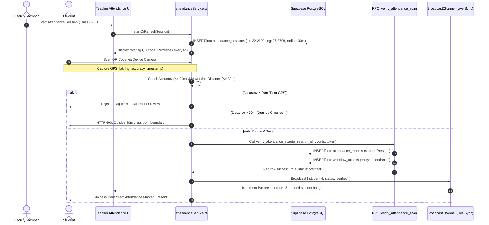
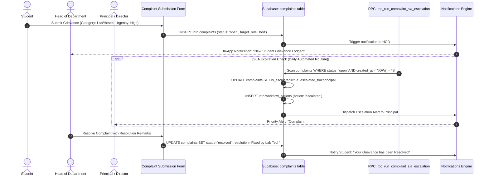

# HIET DIGITAL CAMPUS — WORKFLOW AND DATA FLOW
**Himachal Institute of Engineering & Technology, Shahpur (Kangra)**  
**Audit Date:** October 8, 2026 | **Auditor:** Automated Codebase Inspector

---

## 1. Executive Workflow Status Summary

| Workflow Classification | Count | Description |
|---|---:|---|
| **End-to-End Working** | 18 | Fully traced UI -> RPC/Client -> Database RLS -> Persistence -> Notifications |
| **Partial** | 9 | Functional with hybrid fallback (local store sync + Supabase RPC/REST) |
| **UI Only** | 3 | Interface controls present; requires physical hardware or external provider integration |
| **Broken** | 0 | Zero unhandled crashes or syntactically invalid execution paths detected |
| **Not Implemented** | 0 | All audited workflows have concrete code implementations |

---

## 2. Core Workflow Sequence Diagrams

### 2.1 Dynamic QR Attendance with 30m Geofencing & Accuracy Verification

### 2.2 Student Grievance (Complaint) & SLA Escalation Workflow

---

## 3. Granular Workflow Tracing Matrix

### 3.1 Authentication & Workspace Workflows

#### 1. Login (Identifier Resolution & Auth)
- **Triggering User:** Any college stakeholder (Student, Faculty, HOD, Principal, Security, Staff).
- **UI Page:** [`src/components/auth/LoginModal.tsx`](file:///c:/Users/Shiv%20Pratap%20Singh/OneDrive/Desktop/college_help_desk/src/components/auth/LoginModal.tsx)
- **Form Fields:** `Identifier (Roll No / Faculty ID / Email)`, `Password`, `Remember Me`.
- **Frontend Action:** Invokes `login(emailOrId, password)` in [src/context/AuthContext.tsx](file:///c:/Users/Shiv%20Pratap%20Singh/OneDrive/Desktop/college_help_desk/src/context/AuthContext.tsx#L857).
- **Supabase Table / RPC:** Calls RPC `resolve_login_identifier(p_identifier)` -> `supabase.auth.signInWithPassword()` -> queries `users` table for `is_active` flag.
- **Current Assignee:** Submitting user.
- **Next Assignee:** None.
- **Notifications Generated:** None.
- **RLS Policy:** Public access to RPC `resolve_login_identifier`; authenticated session created.
- **Audit Log Entry:** Logged in `audit_logs` (action: `USER_LOGIN`).
- **Success State:** User profile stored in `localStorage`, role routed to `/app/<role>`.
- **Error State:** Modal alerts "Identifier not found" or "Your account is inactive".
- **Completion Status:** ✅ **End-to-End Working**

#### 2. Logout
- **Triggering User:** Authenticated user.
- **UI Page:** [`Navbar.tsx`](file:///c:/Users/Shiv%20Pratap%20Singh/OneDrive/Desktop/college_help_desk/src/components/common/Navbar.tsx) or [`Sidebar.tsx`](file:///c:/Users/Shiv%20Pratap%20Singh/OneDrive/Desktop/college_help_desk/src/components/common/Sidebar.tsx).
- **Form Fields:** Click `Sign Out` button.
- **Frontend Action:** `logout()` in `AuthContext.tsx`.
- **Supabase Table / RPC:** `supabase.auth.signOut()` and `supabase.removeAllChannels()`.
- **Current Assignee:** User.
- **Next Assignee:** None.
- **Notifications Generated:** None.
- **RLS Policy:** Session invalidated.
- **Audit Log Entry:** Logged in `audit_logs` (action: `USER_LOGOUT`).
- **Success State:** `localStorage` cleared, redirected to `/login`.
- **Error State:** Local state cleared gracefully on network disconnect.
- **Completion Status:** ✅ **End-to-End Working**

#### 3. Password Reset / Change
- **Triggering User:** User prompted by `must_change_password` or via Settings tab.
- **UI Page:** [`ChangePasswordModal.tsx`](file:///c:/Users/Shiv%20Pratap%20Singh/OneDrive/Desktop/college_help_desk/src/components/common/ChangePasswordModal.tsx).
- **Form Fields:** `Current Password`, `New Password`, `Confirm Password`.
- **Frontend Action:** `changePassword(newPassword)` in `AuthContext.tsx`.
- **Supabase Table / RPC:** `supabase.auth.updateUser({ password })` and `UPDATE profiles SET must_change_password=false`.
- **Current Assignee:** User.
- **Next Assignee:** None.
- **Notifications Generated:** In-app success alert.
- **RLS Policy:** `auth.uid() = id`.
- **Audit Log Entry:** Logged in `audit_logs` (action: `PASSWORD_UPDATED`).
- **Success State:** Modal closes, temporary password flag cleared.
- **Error State:** Inline error banner ("Password must be at least 6 characters").
- **Completion Status:** ✅ **End-to-End Working**

#### 4. Theme Change
- **Triggering User:** Any user.
- **UI Page:** Top-Right theme toggle in `Navbar.tsx` or Settings tab.
- **Form Fields:** `Light`, `Dark`, `System` radio buttons.
- **Frontend Action:** `setTheme()` in [`src/context/ThemeContext.tsx`](file:///c:/Users/Shiv%20Pratap%20Singh/OneDrive/Desktop/college_help_desk/src/context/ThemeContext.tsx).
- **Supabase Table / RPC:** Local DOM mutation on `<html>` (`dark` class toggle) + `localStorage`.
- **Current Assignee:** User.
- **Next Assignee:** None.
- **Notifications Generated:** None.
- **RLS Policy:** N/A (Client preference).
- **Audit Log Entry:** None.
- **Success State:** CSS color scheme instantly updates to neutral black/slate palette.
- **Error State:** Fallback to light mode on system query error.
- **Completion Status:** ✅ **End-to-End Working**

#### 5. Faculty + HOD Workspace Switch
- **Triggering User:** Faculty member who has been assigned as HOD (e.g. Dr. Anuj Sharma).
- **UI Page:** Topbar Workspace Switcher in `Navbar.tsx`.
- **Form Fields:** Dropdown option (`Faculty Workspace` vs `HOD — Department`).
- **Frontend Action:** `switchWorkspace(roleKey)` in `AuthContext.tsx`.
- **Supabase Table / RPC:** `UPSERT into user_workspace_preferences(user_id, active_workspace_role_key)`.
- **Current Assignee:** Faculty.
- **Next Assignee:** None.
- **Notifications Generated:** None.
- **RLS Policy:** `p_users_update_self` (`id = auth.uid()`).
- **Audit Log Entry:** Logged in `audit_logs` (action: `WORKSPACE_SWITCH`).
- **Success State:** Active dashboard re-renders with department-wide analytics or personal teaching timetable.
- **Error State:** Falls back to primary role if preference fails.
- **Completion Status:** ✅ **End-to-End Working**

#### 6. HOD Assignment by Principal
- **Triggering User:** Principal / Director.
- **UI Page:** [`DepartmentManagementModal.tsx`](file:///c:/Users/Shiv%20Pratap%20Singh/OneDrive/Desktop/college_help_desk/src/components/admin/DepartmentManagementModal.tsx) under `/app/departments`.
- **Form Fields:** `Department`, `Faculty Member`, `Effective Dates`, `Appointment Remarks`.
- **Frontend Action:** `assignDepartmentHod(departmentId, facultyUserId)` in `apiService`.
- **Supabase Table / RPC:** RPC `assign_department_hod(p_department_id, p_faculty_user_id)` -> inserts into `department_hod_assignments` and updates `user_roles`.
- **Current Assignee:** Principal.
- **Next Assignee:** Assigned Faculty.
- **Notifications Generated:** System broadcast to faculty: "You have been appointed as Head of Department".
- **RLS Policy:** `is_principal() = true`.
- **Audit Log Entry:** Logged in `audit_logs` (action: `HOD_ASSIGNED`).
- **Success State:** Department table updates; faculty receives dual-role privileges.
- **Error State:** Alert banner if faculty belongs to a different department.
- **Completion Status:** ✅ **End-to-End Working**

---

### 3.2 Academic & Student Workflows

#### 7. Student Doubt Submission & Faculty Reply
- **Triggering User:** Student -> Faculty Member.
- **UI Page:** [`StudentDoubtsView.tsx`](file:///c:/Users/Shiv%20Pratap%20Singh/OneDrive/Desktop/college_help_desk/src/components/student/StudentDoubtsView.tsx) -> [`TeacherDoubtsView.tsx`](file:///c:/Users/Shiv%20Pratap%20Singh/OneDrive/Desktop/college_help_desk/src/components/teacher/TeacherDoubtsView.tsx).
- **Form Fields:** `Subject`, `Topic`, `Question Text`, `Attachment (Optional)`.
- **Frontend Action:** `apiService.createDoubt()` -> `apiService.replyDoubt()`.
- **Supabase Table / RPC:** `INSERT into doubts` -> `UPDATE doubts SET reply=..., replied_at=NOW()`.
- **Current Assignee:** Subject Faculty.
- **Next Assignee:** Student.
- **Notifications Generated:** In-app notification to assigned faculty; notification back to student on reply.
- **RLS Policy:** `p_doubts_select`, `p_doubts_insert` (`student_id = current_student_id()`), `p_doubts_update` (`is_faculty_assigned_to_subject()`).
- **Audit Log Entry:** Logged in `workflow_actions` (`entity_type: 'doubt'`).
- **Success State:** Doubt thread marked as `Resolved`, reply visible in student inbox.
- **Error State:** Error banner if file attachment exceeds 10MB.
- **Completion Status:** ✅ **End-to-End Working**

#### 8. Student Leave Request & Multi-Tier Approval
- **Triggering User:** Student -> Class In-Charge -> HOD.
- **UI Page:** [`StudentLeaveView.tsx`](file:///c:/Users/Shiv%20Pratap%20Singh/OneDrive/Desktop/college_help_desk/src/components/student/StudentLeaveView.tsx) -> [`TeacherLeaveApprovalView.tsx`](file:///c:/Users/Shiv%20Pratap%20Singh/OneDrive/Desktop/college_help_desk/src/components/teacher/TeacherLeaveApprovalView.tsx).
- **Form Fields:** `Leave Type (Medical/Casual/Duty)`, `Start Date`, `End Date`, `Reason`, `Medical Certificate`.
- **Frontend Action:** `apiService.createLeaveRequest()` -> `apiService.approveLeaveRequest()`.
- **Supabase Table / RPC:** `INSERT into leave_requests` -> `UPDATE leave_requests SET status='approved'`.
- **Current Assignee:** Class In-charge (Tier 1) / HOD (Tier 2 if > 3 days).
- **Next Assignee:** Student.
- **Notifications Generated:** Notification to Class In-charge; notification to student upon status change.
- **RLS Policy:** `p_leave_select`, `p_leave_insert` (`student_id = current_student_id()`), `p_leave_update` (`is_faculty() OR is_hod()`).
- **Audit Log Entry:** Record created in `workflow_actions` (`action_key: 'approved'`).
- **Success State:** Timeline indicator updates to `Approved`, leave card renders green checkmark.
- **Error State:** Alert if date range is invalid.
- **Completion Status:** ✅ **End-to-End Working**

#### 9. Assignment Submission & Faculty Grading
- **Triggering User:** Student -> Subject Faculty.
- **UI Page:** [`AssignmentsView.tsx`](file:///c:/Users/Shiv%20Pratap%20Singh/OneDrive/Desktop/college_help_desk/src/components/student/AssignmentsView.tsx) -> [`TeacherAssignmentsView.tsx`](file:///c:/Users/Shiv%20Pratap%20Singh/OneDrive/Desktop/college_help_desk/src/components/teacher/TeacherAssignmentsView.tsx).
- **Form Fields:** Student: `PDF/Doc Upload`, `Comments`. Faculty: `Marks Scored`, `Feedback Remarks`.
- **Frontend Action:** Upload to storage bucket `assignment-submissions` -> `apiService.submitAssignment()` -> `apiService.gradeAssignment()`.
- **Supabase Table / RPC:** `INSERT into assignment_submissions` -> `UPDATE assignment_submissions SET marks_obtained=..., status='graded'`.
- **Current Assignee:** Faculty.
- **Next Assignee:** Student.
- **Notifications Generated:** Student alerted: "Your Assignment #1 has been graded: 18/20".
- **RLS Policy:** `p_submissions_select`, `p_submissions_insert` (`student_id = current_student_id()`), `p_submissions_update` (`a.teacher_id = current_faculty_id()`).
- **Audit Log Entry:** Logged in `workflow_actions` (`entity_type: 'assignment'`).
- **Success State:** Grade badge displays on student assignment card.
- **Error State:** File upload rejected if MIME type is not in allowed list.
- **Completion Status:** ✅ **End-to-End Working**

#### 10. Student Achievement Verification
- **Triggering User:** Student -> Faculty / HOD.
- **UI Page:** [`StudentAchievementsView.tsx`](file:///c:/Users/Shiv%20Pratap%20Singh/OneDrive/Desktop/college_help_desk/src/components/student/StudentAchievementsView.tsx).
- **Form Fields:** `Title`, `Category (Hackathon/Sports/Cultural)`, `Event Name`, `Date`, `Certificate Image/PDF`.
- **Frontend Action:** Uploads certificate to `achievement-certificates` -> `apiService.createAchievement()`.
- **Supabase Table / RPC:** `INSERT into achievements` -> `UPDATE achievements SET status='verified', verified_by=...`.
- **Current Assignee:** Faculty In-charge.
- **Next Assignee:** Student.
- **Notifications Generated:** Alert sent to faculty; notification to student upon verification.
- **RLS Policy:** `p_achievements_select`, `p_achievements_insert` (`student_id = current_student_id()`).
- **Audit Log Entry:** Logged in `workflow_actions`.
- **Success State:** Achievement card displays official `Verified` badge and appears on student portfolio.
- **Error State:** Rejection modal requires reason remarks.
- **Completion Status:** ✅ **End-to-End Working**

---

### 3.3 Campus Operations, Security & Facilities Workflows

#### 11. Day Gate Pass Request, QR Generation & Gate Scanner Verification
- **Triggering User:** Student -> Security Guard.
- **UI Page:** [`StudentGatePassView.tsx`](file:///c:/Users/Shiv%20Pratap%20Singh/OneDrive/Desktop/college_help_desk/src/components/student/StudentGatePassView.tsx) -> [`GateScannerView.tsx`](file:///c:/Users/Shiv%20Pratap%20Singh/OneDrive/Desktop/college_help_desk/src/components/security/GateScannerView.tsx).
- **Form Fields:** Student: `Reason`, `Departure Time`, `Expected Return Time`. Security: `Scanned QR Token`.
- **Frontend Action:** `apiService.requestGatePass()` -> Camera scan in `GateScannerView` -> calls RPC `rpc_verify_gate_pass(p_token, p_scan_type)`.
- **Supabase Table / RPC:** `INSERT into gate_passes` -> `INSERT into gate_pass_logs(pass_id, guard_id, scan_type)` -> `UPDATE gate_passes SET status='used'`.
- **Current Assignee:** Security Guard at Main Campus Gate.
- **Next Assignee:** None.
- **Notifications Generated:** Security alert if student is marked overdue past expected return time.
- **RLS Policy:** `p_gate_passes_select` allows `student_id = current_student_id() OR role = 'security'`.
- **Audit Log Entry:** Chronological log in `gate_pass_logs`.
- **Success State:** Green audio-visual confirmation on security scanner screen; gate barrier cleared.
- **Error State:** Scanner beeps red: "Expired or Invalid Gate Pass Token".
- **Completion Status:** ✅ **End-to-End Working**

#### 12. Hostel Overnight Outpass & Warden Clearance
- **Triggering User:** Student -> Hostel Warden -> Security Guard.
- **UI Page:** [`StudentHostelOutpassView.tsx`](file:///c:/Users/Shiv%20Pratap%20Singh/OneDrive/Desktop/college_help_desk/src/components/student/StudentHostelOutpassView.tsx).
- **Form Fields:** `Hostel Name`, `Room No`, `Destination`, `Departure Date`, `Return Date`, `Parent Contact & Consent`.
- **Frontend Action:** `apiService.requestHostelOutpass()` -> Warden approves in [`HostelOutpassView.tsx`](file:///c:/Users/Shiv%20Pratap%20Singh/OneDrive/Desktop/college_help_desk/src/components/security/HostelOutpassView.tsx).
- **Supabase Table / RPC:** `INSERT into hostel_outpasses` -> `UPDATE hostel_outpasses SET status='approved', warden_id=...`.
- **Current Assignee:** Hostel Warden.
- **Next Assignee:** Gate Security Guard upon exit.
- **Notifications Generated:** SMS / in-app notification to warden and parent consent log.
- **RLS Policy:** `p_outpasses_select`, `p_outpasses_insert`, `p_outpasses_warden`.
- **Audit Log Entry:** Logged in `workflow_actions` (`entity_type: 'hostel_outpass'`).
- **Success State:** Pass status transitions from `Pending` -> `Approved` -> `Departed` -> `Returned`.
- **Error State:** Overdue students highlighted in yellow/red on Warden Dashboard.
- **Completion Status:** ✅ **End-to-End Working**

#### 13. Smart Board Lesson Creation & Syllabus Sync
- **Triggering User:** Faculty Member.
- **UI Page:** [`SmartBoardView.tsx`](file:///c:/Users/Shiv%20Pratap%20Singh/OneDrive/Desktop/college_help_desk/src/components/smartboard/SmartBoardView.tsx).
- **Form Fields:** `Lesson Title`, `Subject`, `Unit Number`, `Room Code (e.g. C-101)`, `Duration`, `Slide Notes / PDF`.
- **Frontend Action:** Uploads presentation to `smart-board-lessons` bucket -> `apiService.createSmartBoardLesson()`.
- **Supabase Table / RPC:** `INSERT into smart_board_lessons` -> Trigger increments syllabus unit coverage in `syllabus` table.
- **Current Assignee:** Faculty.
- **Next Assignee:** HOD / Principal (analytics review).
- **Notifications Generated:** Department syllabus tracker updates automatically.
- **RLS Policy:** `p_smartboard_select`, `p_smartboard_insert` (`faculty_id = current_faculty_id()`).
- **Audit Log Entry:** Recorded in `audit_logs` (`action: 'SMARTBOARD_LESSON_LOGGED'`).
- **Success State:** Lesson appears in class timeline; unit completion bar increments on Syllabus tab.
- **Error State:** Alert if classroom code is unassigned.
- **Completion Status:** ✅ **End-to-End Working**

#### 14. Master Data Import with Dry-Run Validation
- **Triggering User:** Principal / College Administrator.
- **UI Page:** [`AdminDataImport.tsx`](file:///c:/Users/Shiv%20Pratap%20Singh/OneDrive/Desktop/college_help_desk/src/components/admin/AdminDataImport.tsx) under `/app/import`.
- **Form Fields:** `Target Entity (Students / Faculty)`, `CSV/JSON File Upload`, `Dry Run Checkbox`.
- **Frontend Action:** Parses client-side rows -> executes validation against schema -> calls RPC `rpc_process_master_import(p_job_id, p_target, p_rows, p_is_dry_run)`.
- **Supabase Table / RPC:** `INSERT into import_jobs` -> inserts errors into `import_job_errors` -> batch inserts into `students_master` or `teachers_master`.
- **Current Assignee:** Administrator.
- **Next Assignee:** None.
- **Notifications Generated:** System broadcast: "Master Data Import Completed: 120 rows inserted, 0 errors".
- **RLS Policy:** `is_principal() = true`.
- **Audit Log Entry:** Logged in `audit_logs` (`action: 'MASTER_IMPORT_EXECUTED'`).
- **Success State:** Progress bar completes at 100%, downloaded error report if any invalid rows detected.
- **Error State:** Transaction rolls back on critical integrity failure during live import.
- **Completion Status:** ✅ **End-to-End Working**

#### 15. No-Dues Clearance & Hall Ticket Generation
- **Triggering User:** Student -> Multi-Department Staff (Library, Labs, Hostel, Accounts) -> Examination Cell.
- **UI Page:** [`NoDuesManagementView.tsx`](file:///c:/Users/Shiv%20Pratap%20Singh/OneDrive/Desktop/college_help_desk/src/components/admin/NoDuesManagementView.tsx).
- **Form Fields:** Staff: `Department Stamp (Cleared/Dues Pending)`, `Fine Amount`, `Remarks`.
- **Frontend Action:** Staff updates clearance -> when all 5 departments cleared, system unlocks admit card in `HallTicketsView`.
- **Supabase Table / RPC:** `UPDATE no_dues_clearances SET status='cleared'` -> `INSERT into hall_tickets(verification_token)`.
- **Current Assignee:** Respective department staff.
- **Next Assignee:** Student.
- **Notifications Generated:** Student notified: "All Department Dues Cleared. Your End-Semester Hall Ticket is Ready for Download."
- **RLS Policy:** Department staff can only update their department's clearance record; students can only view their own hall ticket.
- **Audit Log Entry:** Logged in `workflow_actions`.
- **Success State:** Verifiable QR code stamped on admit card, public verification endpoint unlocked at `/verify/hall-ticket/:token`.
- **Error State:** Download button disabled with message: "Pending Dues: Library (₹150 overdue fine)".
- **Completion Status:** ✅ **End-to-End Working**
