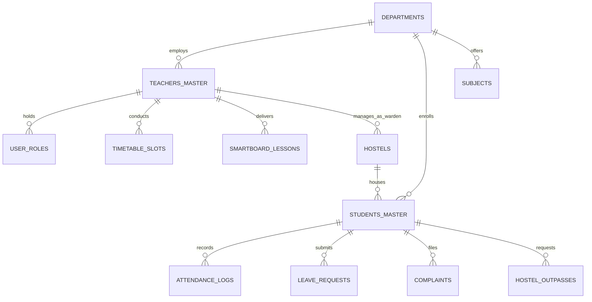

# HIET DIGITAL CAMPUS — DEMO DATA STRUCTURE & SCHEMA SPECIFICATION
**Institution:** Himachal Institute of Engineering & Technology, Shahpur (H.P.)  
**Documentation Version:** 2026.1  
**Scope:** Data Architecture, Entity Relational Models, Geofence Boundaries, and Data Dictionary

---

## 1. System Architecture & Dual-Engine Operation

The HIET Digital Campus operates on a **Dual-Engine Persistence Strategy**:
1. **Production Engine (Supabase PostgreSQL):** High-integrity relational backend with Row-Level Security (RLS) policies, JSON Web Token (JWT) role claims, and transactional triggers.
2. **Development / Offline Engine (`src/lib/mockData.ts` & `src/lib/mockDemoUsers.ts`):** In-browser React state store providing comprehensive offline development capabilities, rapid persona evaluation, and automated unit testing without requiring an active Supabase cloud connection.

Both engines strictly adhere to identical field naming conventions, foreign keys, and status enums.



---

## 2. Core Entity Schemas & Relations

### 2.1. Departments (`departments`)
Tracks academic departments, HOD assignments, and academic years.

```sql
CREATE TABLE public.departments (
  id UUID PRIMARY KEY DEFAULT gen_random_uuid(),
  code TEXT NOT NULL UNIQUE,       -- 'CSE', 'ECE', 'ME', 'CE', 'EE'
  name TEXT NOT NULL,              -- e.g. 'Computer Science & Engineering'
  hod_user_id UUID,                -- Foreign key to auth.users (Dr. Anuj Sharma for CSE)
  academic_year TEXT DEFAULT '2026-2027',
  created_at TIMESTAMPTZ DEFAULT now()
);
```

### 2.2. Multi-Role Assignments (`user_roles`)
Enables a single user to hold multiple administrative and faculty roles without duplication.

```sql
CREATE TABLE public.user_roles (
  id UUID PRIMARY KEY DEFAULT gen_random_uuid(),
  user_id UUID NOT NULL REFERENCES auth.users(id) ON DELETE CASCADE,
  role_name TEXT NOT NULL,         -- 'faculty', 'hod', 'class_incharge', 'warden'
  scope_type TEXT,                 -- 'department', 'section', 'hostel'
  scope_value TEXT,                -- 'CSE', 'ECE', 'GIRLS-HOSTEL-A', 'BOYS-HOSTEL-B'
  semester INT,                    -- e.g. 1
  section TEXT,                    -- e.g. 'A'
  academic_year TEXT DEFAULT '2026-2027',
  is_active BOOLEAN DEFAULT true,
  created_at TIMESTAMPTZ DEFAULT now(),
  UNIQUE(user_id, role_name, scope_value, semester, section)
);
```

### 2.3. Faculty Master (`teachers_master`)
Stores faculty profiles, designations, contact information, and administrative flags.

| Field Name | Type | Constraints | Description |
| :--- | :--- | :--- | :--- |
| `id` | `UUID / TEXT` | PRIMARY KEY | Unique faculty master key |
| `faculty_id` | `TEXT` | NOT NULL, UNIQUE | Institutional employee code (e.g. `HIET-FAC-CSE-001`) |
| `full_name` | `TEXT` | NOT NULL | Full faculty name with salutation |
| `department` | `TEXT` | NOT NULL | Academic department (`CSE` or `ECE`) |
| `designation` | `TEXT` | NOT NULL | Academic title (e.g. `HOD & Assistant Professor`) |
| `college_email`| `TEXT` | NOT NULL, UNIQUE | Institutional login email (`anuj.sharma@hiet.demo`) |
| `phone` | `TEXT` | NOT NULL | Mobile number |
| `role` | `TEXT` | NOT NULL | Base primary role (`teacher` / `faculty`) |
| `is_hod` | `BOOLEAN` | DEFAULT false | True for Dr. Anuj Sharma & Dr. Kavita Joshi |
| `is_warden` | `BOOLEAN` | DEFAULT false | True for Ms. Neha Kapoor & Ms. Pooja Thakur |
| `warden_hostel_code` | `TEXT` | NULLABLE | Assigned hostel block code |
| `is_class_incharge` | `BOOLEAN` | DEFAULT false | True for Mr. Rohit Mehta |
| `status` | `TEXT` | DEFAULT 'active' | Operational status |

### 2.4. Students Master (`students_master`)
Master registry of all enrolled students, residential allocations, CGPA, and test cases.

| Field Name | Type | Constraints | Description |
| :--- | :--- | :--- | :--- |
| `id` | `UUID / TEXT` | PRIMARY KEY | Unique student master key |
| `roll_no` | `TEXT` | NOT NULL, UNIQUE | Institutional roll number (e.g. `HIET-CSE-2026-001`) |
| `name` | `TEXT` | NOT NULL | Full student name |
| `course` | `TEXT` | DEFAULT 'B.Tech'| Degree program |
| `department` | `TEXT` | NOT NULL | Department (`CSE` or `ECE`) |
| `branch` | `TEXT` | NOT NULL | Specialization branch |
| `semester` | `INT` | NOT NULL | Current semester (1) |
| `section` | `TEXT` | NOT NULL | Section allocation ('A') |
| `gender` | `TEXT` | NOT NULL | 'Male' or 'Female' |
| `hostel_code` | `TEXT` | NULLABLE | `GIRLS-HOSTEL-A`, `BOYS-HOSTEL-B`, or NULL (Day Scholar) |
| `hostel_name` | `TEXT` | NULLABLE | Human-readable hostel block name |
| `room_no` | `TEXT` | NULLABLE | Assigned room number (e.g. `R-101`, `R-201`) |
| `attendance_percentage` | `FLOAT` | NOT NULL | Aggregate attendance percentage (62% to 94%) |
| `cgpa` | `FLOAT` | NOT NULL | Cumulative Grade Point Average (6.10 to 9.40) |
| `test_case` | `TEXT` | NULLABLE | Designated testing scenario |
| `college_email`| `TEXT` | NOT NULL, UNIQUE | Student login email |
| `status` | `TEXT` | DEFAULT 'active' | Student enrollment status |

### 2.5. Hostels (`hostels`)
Residential blocks mapped to faculty wardens.

```sql
CREATE TABLE public.hostels (
  id UUID PRIMARY KEY DEFAULT gen_random_uuid(),
  hostel_code TEXT NOT NULL UNIQUE, -- 'GIRLS-HOSTEL-A', 'BOYS-HOSTEL-B'
  hostel_name TEXT NOT NULL,        -- 'Girls Hostel Block A', 'Boys Hostel Block B'
  gender_type TEXT NOT NULL,        -- 'girls', 'boys'
  warden_user_id UUID,              -- Foreign key to auth.users
  warden_employee_code TEXT,        -- 'HIET-FAC-CSE-003', 'HIET-FAC-ECE-002'
  warden_name TEXT,                 -- 'Ms. Neha Kapoor', 'Ms. Pooja Thakur'
  capacity INT DEFAULT 120,
  is_active BOOLEAN DEFAULT true,
  created_at TIMESTAMPTZ DEFAULT now()
);
```

---

## 3. Academic & Operational Entity Schemas

### 3.1. Timetable Slots & Geofence Coordinates (`timetable_slots`)
Defines weekly schedule with room spatial coordinates for QR attendance geofencing.

| Slot Parameter | Value / Schema | Details |
| :--- | :--- | :--- |
| `day` | `TEXT` | 'Monday', 'Tuesday', ... |
| `start_time` / `end_time` | `TEXT` | e.g. "09:00 AM", "10:00 AM" |
| `start_hour_24` / `end_hour_24` | `INT` | 9, 10 (Used for active class highlighting) |
| `subject_code` | `TEXT` | `BTPH101`, `BTCS104`, `BTMA102`, `BTEE103`, `BTHM105`, `BTCS106` |
| `room_number` | `TEXT` | `C-101`, `C-102`, `C-103`, `C-104`, `C-105`, `C-LAB-1` |
| `room_lat` | `FLOAT` | **32.219000** (Latitude coordinate for C-101) |
| `room_long` | `FLOAT` | **76.270800** (Longitude coordinate for C-101) |
| `geofence_radius_meters` | `INT` | **30** (Meters allowed radius for student QR scan) |
| `academic_year` | `TEXT` | '2026-2027' |

### 3.2. Tiered Leave Requests (`leave_requests`)
Supports progressive approval stages based on duration thresholds:
- **1–2 Days:** Approved directly by Class In-Charge (`class_incharge`)
- **3–6 Days:** Recommended by Class In-Charge ➔ Approved by HOD (`hod`)
- **7+ Days:** Endorsed by Faculty & HOD ➔ Final sanction by Principal (`principal`)

| Field Name | Type | Description |
| :--- | :--- | :--- |
| `id` / `leave_id` | `TEXT / UUID` | Unique leave request identifier |
| `student_id` | `TEXT` | Reference to student |
| `total_days` | `INT` | Duration in calendar days |
| `status` | `TEXT` | `pending_faculty`, `pending_hod`, `pending_principal`, `approved`, `rejected` |
| `current_stage` | `TEXT` | `faculty`, `hod`, `principal`, `completed` |
| `current_assignee_user_id` | `TEXT` | User ID of current reviewer |
| `current_assignee_name` | `TEXT` | Name of assigned reviewer |
| `reviewed_by` / `reviewed_by_name` | `TEXT` | User ID & Name of previous stage approver |
| `approval_remarks` | `TEXT` | Official endorsement comments |
| `document_url` | `TEXT` | Medical slip / hackathon letter URL |

### 3.3. Grievances & 48h SLA Escalation (`complaints`)
Categorized tickets with automatic SLA escalation triggers.

| Field Name | Type | Description |
| :--- | :--- | :--- |
| `id` | `TEXT / UUID` | Unique complaint tracking identifier |
| `category` | `TEXT` | `Infrastructure`, `Academic`, `Hostel`, `Other` |
| `department` | `TEXT` | Associated department (`CSE`, `ECE`) |
| `title` | `TEXT` | Summary of issue (e.g. `C-101 fan is not working`) |
| `description` | `TEXT` | Detailed problem description |
| `priority` | `TEXT` | `Low`, `Medium`, `High`, `Urgent` |
| `status` | `TEXT` | `Submitted`, `Under Review`, `Escalated to MD`, `Resolved` |
| `escalated_to_md` | `BOOLEAN` | Set to true when ticket exceeds 48 hours unresolved |
| `escalation_reason` | `TEXT` | Reason for executive escalation |
| `created_at` | `TIMESTAMPTZ` | Timestamp (> 48h for SLA test ticket) |

### 3.4. Smart Board Synchronized Lessons (`smartboard_lessons`)
Classroom whiteboard recordings converted into searchable study notes.

| Field Name | Type | Description |
| :--- | :--- | :--- |
| `id` | `TEXT` | Unique lesson identifier |
| `teacher_id` | `TEXT` | Faculty employee code |
| `subject_code` | `TEXT` | `BTPH101`, `BTCS104`, `BTMA102`, `BTEE103`, `ECPH101`, `ECEC103` |
| `unit` | `TEXT` | Curriculum unit (e.g. `Unit 1: Laser`) |
| `topic` | `TEXT` | Lesson title (e.g. `He-Ne Laser`) |
| `notes_summary` | `TEXT` | Key teaching summary |
| `ai_summary` | `TEXT` | Automated AI learning breakdown |
| `ai_learning_objectives` | `TEXT[]` | Key student takeaways |
| `sync_status` | `TEXT` | `Synced`, `Pending Sync` |
| `lesson_file_url` | `TEXT` | URL to exported whiteboard PDF |

---

## 4. Campus Location & Geofence Coordinates Reference

| Location Identifier | Location Name | Building Code | Latitude | Longitude | Geofence Radius |
| :--- | :--- | :--- | :---: | :---: | :---: |
| `LOC-C101` | **Classroom C-101 (Physics)** | `ACAD-01` | **32.219000** | **76.270800** | **30 meters** |
| `LOC-C102` | Classroom C-102 (Maths) | `ACAD-01` | 32.219150 | 76.270950 | 30 meters |
| `LOC-C103` | Classroom C-103 (PPS) | `ACAD-01` | 32.219280 | 76.271100 | 30 meters |
| `LOC-CLAB1` | Computing Lab C-LAB-1 | `ACAD-01` | 32.219400 | 76.271250 | 35 meters |
| `LOC-WAR-A` | Girls Hostel Block A | `HOSTEL-A` | 32.221500 | 76.273000 | 50 meters |
| `LOC-WAR-B` | Boys Hostel Block B | `HOSTEL-B` | 32.222800 | 76.274200 | 50 meters |
| `LOC-GATE1` | Campus Main Gate Checkpoint | `GATE-01` | 32.218500 | 76.269800 | 25 meters |
| `LOC-LIB` | Central Library | `LIB-01` | 32.220100 | 76.271800 | 40 meters |

---

## 5. Security & Row-Level Access Policies Summary

1. **Student Row-Level Isolation:**
   - `SELECT` on `students_master`: Own record only.
   - `SELECT` on `attendance_logs`: Own student logs only.
   - `SELECT` on `academic_records`: Own results only.
2. **Faculty Row-Level Access:**
   - `SELECT` on `timetable_slots`: Subjects assigned to faculty or general section view.
   - `UPDATE` on `attendance_sessions`: Permitted only for faculty teaching that slot.
3. **Department HOD Scope:**
   - Full read/write access to students, faculty workloads, and leaves within assigned department (`scope_value = 'CSE'` or `'ECE'`).
4. **Hostel Warden Scope:**
   - Restricted to resident students matching `warden_hostel_code` (`GIRLS-HOSTEL-A` for Neha Kapoor, `BOYS-HOSTEL-B` for Pooja Thakur).
5. **Executive & Audit Scope:**
   - Principal & Managing Director hold institutional oversight across all departments and dormitories.
