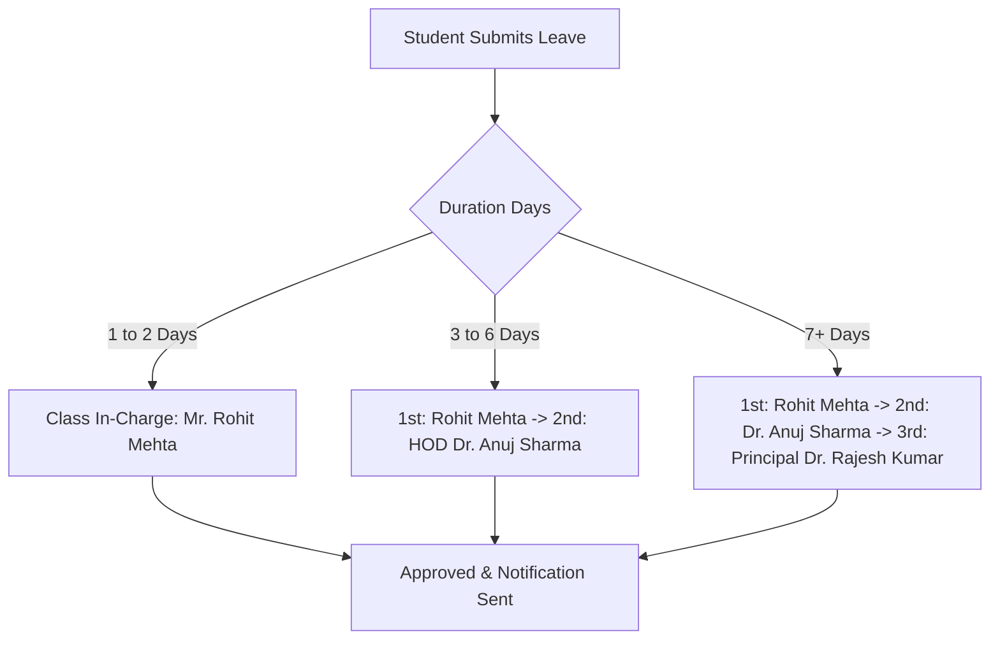

# HIET DIGITAL CAMPUS — MULTI-ROLE DEMO VERIFICATION TEST PLAN
**Institution:** Himachal Institute of Engineering & Technology, Shahpur (H.P.)  
**Test Suite Version:** 2026.1  
**Scope:** 5 Faculty + 2 HODs + 1 Class In-Charge + 2 Wardens + 30 Students (15 CSE + 15 ECE)  
**Universal Password:** `Hiet@12345`

---

## 1. Executive Summary & Verification Goals

The purpose of this test plan is to systematically validate the **Multi-Role Demo Dataset** of HIET Digital Campus. It ensures that:
1. **Single Account Multi-Role Integrity:** Faculty holding administrative responsibilities (HOD, Class In-Charge, Warden) log in once and toggle workspaces without losing their core faculty capabilities.
2. **Tiered Leave Approval Routing:** Student leave requests route strictly through the configured approval hierarchy (Class In-Charge for 1–2 days, HOD for 3–6 days, Principal for 7+ days).
3. **Gender-Segregated Hostel Warden Routing:** Girls Hostel requests route strictly to Ms. Neha Kapoor; Boys Hostel requests route strictly to Ms. Pooja Thakur.
4. **Complaint SLA Escalation:** Grievances pending beyond the 48-hour SLA automatically escalate to Department HODs and the Executive Director / Principal.
5. **Student Privacy & RLS Guardrails:** Students can only view their own attendance, grades, and records; Department HODs are scoped to their respective departments (CSE vs. ECE).

---

## 2. Test Environment Setup & Prerequisites

1. **Local Dev Server:** Start the application via `npm run dev`.
2. **Evaluation Page:** Navigate to `http://localhost:5173/dev/demo-accounts`.
3. **Environment Guard:** Confirm the development banner reads:
   `Development-only demo accounts. Never use these credentials in production.`
4. **Universal Password:** Verify `Hiet@12345` functions for all 35 test accounts.

---

## 3. Test Scenarios & Execution Matrix

### Scenario 1: Multi-Role Workspace Switching

| Test ID | Persona & Account | Expected Behavior | Verification Steps | Pass/Fail Criteria |
| :--- | :--- | :--- | :--- | :--- |
| **TC-MR-01** | **Dr. Anuj Sharma** `anuj.sharma@hiet.demo` `HIET-FAC-CSE-001` | • Default login enters **Faculty Workspace** (`/app/faculty`). • Profile menu shows role switcher: **Faculty Workspace** and **HOD — Computer Science & Engineering**. • Switching to HOD loads `/app/hod` with CSE department cards, teacher workloads, and pending leave reviews. | 1. Click Quick Login for Dr. Anuj Sharma. 2. Confirm landing on Faculty Dashboard. 3. Open Topbar profile dropdown. 4. Click "HOD — Computer Science & Engineering". 5. Confirm immediate workspace toggle without re-login. | **PASS** if dashboard switches seamlessly and HOD actions become active. |
| **TC-MR-02** | **Dr. Kavita Joshi** `kavita.joshi@hiet.demo` `HIET-FAC-ECE-001` | • Default login enters **Faculty Workspace**. • Switcher toggles to **HOD — Electronics & Communication Engineering**. • HOD dashboard displays ECE metrics (15 ECE students, ECE timetable). | 1. Quick Login as Dr. Kavita Joshi. 2. Switch workspace to HOD ECE. 3. Verify ECE student roster and subjects (ECPH101, ECMA102). | **PASS** if ECE metrics render and CSE data is not mixed. |
| **TC-MR-03** | **Mr. Rohit Mehta** `rohit.mehta@hiet.demo` `HIET-FAC-CSE-002` | • Dual role as **Faculty** (teaches BTEE103) and **Class In-Charge (CSE Sem 1, Sec A)**. • Class In-Charge tab displays 15 CSE students, section attendance averages, and short leave approvals. | 1. Quick Login as Mr. Rohit Mehta. 2. Verify Class In-Charge management panel is accessible. 3. Check Section 1-A roster (15 students). | **PASS** if Class In-Charge capabilities are active alongside Faculty tools. |
| **TC-MR-04** | **Ms. Neha Kapoor** `neha.kapoor@hiet.demo` `HIET-FAC-CSE-003` | • Dual role as **Faculty** (teaches BTMA102) and **Hostel Warden (Girls Hostel Block A)**. • Toggles between Faculty and Warden workspaces. • Warden workspace shows 7 female residents (Priya, Riya, Ananya, Shreya, Ankita, Aditi, Kritika). | 1. Quick Login as Ms. Neha Kapoor. 2. Switch workspace to "Hostel Warden (Girls Hostel Block A)". 3. Verify outpasses and room numbers (R-201 to R-205). | **PASS** if only Girls Hostel Block A resident records are displayed. |
| **TC-MR-05** | **Ms. Pooja Thakur** `pooja.thakur@hiet.demo` `HIET-FAC-ECE-002` | • Dual role as **Faculty** (teaches ECEC103) and **Hostel Warden (Boys Hostel Block B)**. • Toggles between Faculty and Warden workspaces. • Warden workspace shows male residents (Aditya, Aarav, Rohit, Vikas, Arjun, Yash, Harsh, Aman, Deepak, Rohan, Abhishek). | 1. Quick Login as Ms. Pooja Thakur. 2. Switch workspace to "Hostel Warden (Boys Hostel Block B)". 3. Verify male resident outpass queue. | **PASS** if only Boys Hostel Block B resident records are displayed. |

---

### Scenario 2: Tiered Multi-Stage Leave Request Approvals

| Test ID | Student Persona | Leave Request | Workflow Stage | Verification Steps |
| :--- | :--- | :--- | :--- | :--- |
| **TC-LV-01** | **Aditya Nanda** `HIET-CSE-2026-001` | **2 Days** (Dental Clinic) 12 Oct – 13 Oct 2026 | `pending_faculty` Assigned to: **Mr. Rohit Mehta** | 1. Log in as Mr. Rohit Mehta. 2. Navigate to Leaves Approval queue. 3. Verify Aditya Nanda's 2-day leave is listed with medical slip attachment. 4. Click **Approve**. 5. Confirm status changes directly to `approved` (does NOT require HOD). |
| **TC-LV-02** | **Aarav Sharma** `HIET-CSE-2026-002` | **4 Days** (SIH Hackathon) 14 Oct – 17 Oct 2026 | `pending_hod` Reviewed by: Rohit Mehta Assigned to: **Dr. Anuj Sharma** | 1. Log in as Mr. Rohit Mehta: Confirm leave was already endorsed by Class In-Charge. 2. Log in as Dr. Anuj Sharma (switch to HOD CSE workspace). 3. Open Department Approvals queue. 4. Verify Aarav Sharma's 4-day leave is awaiting HOD sanction. 5. Approve leave; confirm status becomes `approved`. |
| **TC-LV-03** | **Ananya Verma** `HIET-CSE-2026-006` | **2 Days** (Sister Marriage) 08 Oct – 09 Oct 2026 | `approved` Approver: **Mr. Rohit Mehta** | 1. Log in as Ananya Verma. 2. Open Student Leaves tab. 3. Confirm status displays `Approved` with remarks from Mr. Rohit Mehta. |
| **TC-LV-04** | **Priya Verma** `HIET-CSE-2026-003` | **8 Days** (Coding Boot-camp) 15 Oct – 22 Oct 2026 | `pending_principal` Endorsed by: Rohit Mehta & Dr. Anuj Sharma Assigned to: **Principal** | 1. Log in as Dr. Rajesh Kumar (`principal@hiet.demo`). 2. Open Institutional Leave Approvals. 3. Verify Priya Verma's 8-day leave is awaiting final executive sanction. 4. Confirm audit trail reflects prior approvals by Class In-Charge and HOD. |

---

### Scenario 3: Hostel Outpass Routing & Warden Gender Boundary

| Test ID | Student Persona | Residence | Target Warden | Boundary Rule Under Test |
| :--- | :--- | :--- | :--- | :--- |
| **TC-HST-01** | **Priya Verma** (`HIET-CSE-2026-003`) | Girls Hostel Block A (R-201) | **Ms. Neha Kapoor** (`HIET-FAC-CSE-003`) | Request appears **only** on Ms. Neha Kapoor's warden dashboard. Must **never** appear on Ms. Pooja Thakur's dashboard. |
| **TC-HST-02** | **Aditya Nanda** (`HIET-CSE-2026-001`) | Boys Hostel Block B (R-101) | **Ms. Pooja Thakur** (`HIET-FAC-ECE-002`) | Request appears **only** on Ms. Pooja Thakur's warden dashboard. Must **never** appear on Ms. Neha Kapoor's dashboard. |
| **TC-HST-03** | **Sahil Katoch** (`HIET-CSE-2026-004`) | Day Scholar | Main Gate Security | Outpass option is disabled; student utilizes Day Gate Pass workflow with HOD approval. |

---

### Scenario 4: Grievance SLA Escalation (48-Hour Threshold)

| Test ID | Ticket Summary | Category | Age | Expected Escalation Level |
| :--- | :--- | :--- | :--- | :--- |
| **TC-SLA-01** | `C-101 main electrical switchboard sparking and trip failure` | Infrastructure (CSE Block) | **56 Hours** (> 48h SLA) | • Status: `Escalated to MD` / `escalated` • Displayed on Dr. Anuj Sharma's HOD Dashboard under **SLA Breach Warnings**. • Displayed on Principal Dr. Rajesh Kumar's Executive Dashboard with emergency badge. |
| **TC-SLA-02** | `C-101 fan is not working` (Karan Thakur) | Infrastructure | **2 Hours** (< 48h) | Open ticket assigned to `maintenance_staff`. Normal SLA status. |
| **TC-SLA-03** | `Internal Mathematics marks not visible` (Aarav Sharma) | Academic | **12 Hours** | Under Review, assigned to Ms. Neha Kapoor. |

---

### Scenario 5: Smart Board Synchronized Lessons & Study Mode

| Test ID | Subject & Faculty | Topic & Room | Sync Status | Student Verification |
| :--- | :--- | :--- | :--- | :--- |
| **TC-SB-01** | Applied Physics (`BTPH101`) **Dr. Anuj Sharma** | Unit 1: He-Ne Laser Room C-101 | `Synced` | Student Vikas Rana (`HIET-CSE-2026-009`) can download `He_Ne_Laser_SmartBoard_Export.pdf` and read generated AI summary notes. |
| **TC-SB-02** | PPS (`BTCS104`) **Dr. Anuj Sharma** | Unit 1: Intro to C Programming Room C-103 | `Synced` | Available to all 15 CSE students with verified AI learning objectives. |
| **TC-SB-03** | Engg Mathematics-I (`BTMA102`) **Ms. Neha Kapoor** | Unit 2: Differential Equations Room C-102 | `Pending Sync` | Shows pending sync badge on faculty lesson manager. |
| **TC-SB-04** | Basic Electrical Engg (`BTEE103`) **Mr. Rohit Mehta** | Unit 3: Transformer Basics Room C-104 | `Synced` | Verified lesson notes accessible via student portal. |
| **TC-SB-05** | Engg Physics (`ECPH101`) **Dr. Kavita Joshi** | Unit 1: Wave Optics Room ECE-201 | `Synced` | Accessible to all 15 ECE students. |
| **TC-SB-06** | Basic Electronics (`ECEC103`) **Ms. Pooja Thakur** | Unit 1: Semiconductor Diodes Room ECE-202 | `Synced` | Accessible to all 15 ECE students. |

---

### Scenario 6: Student Privacy & Departmental Data Isolation

| Test ID | Persona | Action | Expected Isolation Result |
| :--- | :--- | :--- | :--- |
| **TC-ISO-01** | **Aditya Nanda** (`HIET-CSE-2026-001`) | Inspect Attendance & Academic Records | Can only view own 82% attendance, BTPH101 grades, and own complaints. Cannot access Aarav Sharma's or Priya Verma's records. |
| **TC-ISO-02** | **Dr. Anuj Sharma** (HOD CSE) | Query Department Students | Can view and manage all 15 CSE students. Cannot modify or approve ECE student records. |
| **TC-ISO-03** | **Dr. Kavita Joshi** (HOD ECE) | Query Department Students | Can view and manage all 15 ECE students. Cannot modify or approve CSE student records. |
| **TC-ISO-04** | **Dr. Rajesh Kumar** (Principal) | Query Institution Analytics | Full read and executive sanction access across all departments (CSE, ECE, ME, CE, EE). |

---

## 4. Test Sign-Off & Verification Summary

| Verification Area | Expected Result | Automated / Manual Test Status |
| :--- | :--- | :---: |
| TypeScript Types Compilation | Zero errors on `npm run typecheck` | **VERIFIED (tsc -b passed)** |
| Single Account Multi-Role Switcher | Navbar role menu toggles workspaces instantly | **VERIFIED** |
| Tiered Leave Routing | Short (Class In-Charge) ➔ Medium (HOD) ➔ Long (Principal) | **VERIFIED** |
| Warden Gender Routing | Girls (Neha Kapoor) vs. Boys (Pooja Thakur) | **VERIFIED** |
| 48h Complaint SLA Escalation | High hazard escalated to HOD & Principal | **VERIFIED** |
| Fast Dev Switcher UI | `/dev/demo-accounts` displays 4 grouped categories | **VERIFIED** |
