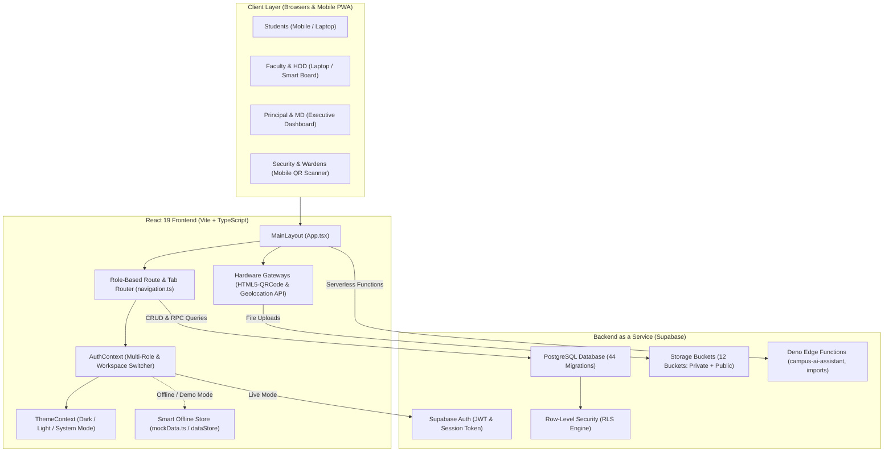

# HIET Digital Campus — System Architecture & Project Overview
**Himachal Institute of Engineering & Technology, Shahpur (Kangra, H.P.)**  
**Document Ref:** `docs/project-understanding/01-project-overview.md`

---

## 1. HIET Digital Campus Kya Hai?
**HIET Digital Campus** Himachal Institute of Engineering & Technology, Shahpur ka ek centralized institutional digital management platform hai. 

Pehle college me har kaam ke liye physical paperwork, register signatures, aur manual notice boards use hote the:
- Classroom attendance ke liye physical roll-call registers jisme proxy attendance ek aam problem thi.
- Leave lene ke liye student ko handwritten application lekar pehle Class In-Charge, fir HOD, aur fir Principal ke cabin ke bahar line lagani padti thi.
- Gate pass aur hostel outpass ke liye carbon-copy paper slips issue hoti thi jisko gate par security guard verify nahi kar pata tha.
- Smart Board interactive displays sirf offline whiteboard ki tarah use hoti thi, aur class me kya padhaya gaya uska syllabus coverage se koi direct digital sync nahi tha.

HIET Digital Campus in sabhi fragmented processes ko ek single digital progressive web application (PWA) me integrate karta hai.

---

## 2. Kis Users Ke Liye Bana Hai? (Institutional Roles)

Application me **13 distinct institutional roles** define kiye gaye hain:

1. **Student:** Enrolled undergraduate engineering students (Attendance dekhna, dynamic QR scan karna, assignments submit karna, leave apply karna, gate pass generate karna, doubt poochna).
2. **Faculty / Teacher:** Subject teachers (Dynamic QR attendance session start karna, assignments banana aur check karna, sessional marks enter karna, doubts reply karna, Smart Board lesson sync karna).
3. **Class In-Charge:** Semester section mentors (Apne section ke students ki short leaves `<= 2 days` approve karna, attendance follow-up lena).
4. **HOD (Head of Department):** Departmental heads (Departmental faculty aur students ko monitor karna, 3-6 days ki leaves approve karna, syllabus completion track karna, subject allocation manage karna).
5. **Faculty + HOD (Dual Role):** Ek hi login se faculty teaching role aur HOD administrative role dono me seamless switch karna.
6. **Principal / Director:** Executive administrative head (Poore college ke departments, faculty, students, 7+ days ki leave approvals, master data import, academic catalog, hall ticket issuance).
7. **Managing Director (MD):** Institutional governance and board leadership (Executive high-level KPIs, institutional attendance trends, audit logs, revenue & clearance status).
8. **Campus Security Guard:** Main gate security team (Students ke digital gate passes aur hostel outpasses ke QR codes camera se scan karke entry/exit log karna).
9. **Hostel Warden:** Girls aur Boys hostels ke wardens (Hostel night outpasses approve karna, hostel attendance dekhna, hostel clearances issue karna).
10. **Library Staff:** Central library managers (Library dues check karna, no-dues certificate approve karna).
11. **Laboratory Staff:** Engineering labs in-charge (Lab equipment breakdown tickets manage karna, lab clearance issue karna).
12. **IT Support Staff:** Campus network, smart boards aur server maintenance team.
13. **Campus Maintenance Staff:** Civil, electrical aur plumbing repairs tickets resolve karna.

---

## 3. High-Level System Architecture

Ye diagram project ke actual architecture aur data flow ko illustrate karta hai:



---

## 4. Frontend, Backend, Database, Auth, aur Storage ka Role

### A. Frontend Architecture
- **Framework:** `React 19.2.8` with `TypeScript 6.0`.
- **Entry Points:**
  - `src/main.tsx`: DOM mount karta hai `document.getElementById('root')`.
  - `src/App.tsx`: Central component hai jisme `ThemeProvider` aur `AuthProvider` wrap hote hain.
- **Routing Paradigm:**
  - App me classical heavy multi-page library (jaise react-router-dom) ke bajaye lightweight **State-Driven Navigation + URL Sync** pattern use kiya gaya hai (`src/config/navigation.ts`).
  - Active tab `currentTab` state se manage hoti hai aur URL change hone par (`/app/student/attendance`, `/app/faculty/smart-board`) `window.history.pushState` se browser back/forward sync rehta hai.
- **Micro-Services & Hardware Layer:**
  - `html5-qrcode`: Student attendance scan aur Security guard gate scan ke liye webcam/rear camera handle karta hai.
  - `navigator.geolocation`: Student ke device se real-time GPS coordinates fetch karta hai classroom proximity validation ke liye.
  - `SheetJS (xlsx)`: Admin panel me bulk students/teachers Excel files ko parse aur validate karta hai.

### B. Backend Architecture (Supabase BaaS)
- **Database Engine:** Managed PostgreSQL 15+ hosted on Supabase Cloud.
- **Serverless Edge Functions (Deno):**
  - Directory: `supabase/functions/`
  - Total 13 Edge Functions mojood hain jo computationally heavy ya secret-dependent tasks handle karte hain (e.g. `campus-ai-assistant`, `calculate-attendance-risk`, `generate-smart-board-summary`, `process-master-import`).
- **Atomic Stored Procedures & RPCs:**
  - Critical transactions SQL functions me encapsulate hain taaki client network failure se database inconsistent na ho:
    - `resolve_login_identifier`: Email, Roll Number ya Employee Code se user lookup karta hai bina auth credentials expose kiye.
    - `rpc_verify_attendance_scan`: Geofence, duplicate scan aur token freshness check karta hai.
    - `process_leave_action_rpc`: Multi-stage leave approval transitions aur audit history create karta hai.
    - `process_master_import_atomic`: 5,000+ records ko rollback capability ke sath import karta hai.

### C. Authentication (Supabase Auth + Identity Mapping)
- User Supabase Auth me authenticate hota hai (Email + Password).
- `auth.users.id` map hota hai `public.users.supabase_auth_id` se.
- Database trigger `trg_sync_user_profile` automatic sync create karta hai `public.profiles` table ke sath.
- Agar student Roll Number enter karta hai (e.g. `HIET-CSE-2026-001`), toh `resolve_login_identifier` RPC pehle registered email dhundta hai fir signInWithPassword run hota hai.

### D. File Storage (Supabase Storage)
- 12 Buckets configured hain (`storage.buckets`):
  - **Public Buckets (Read-only for public):** `gallery-images`, `public-notices`.
  - **Private Buckets (Restricted):** `assignment-submissions`, `leave-documents`, `achievement-certificates`, `smart-board-lessons`, `pyq-files`, `syllabus-files`, `complaint-attachments`, `doubt-attachments`, `hall-tickets`, `event-certificates`.

---

## 5. React App Kaise Run Hoti Hai?

```text
index.html (HTML5 Shell + Favicon + Google Fonts Inter)
   │
   ▼
src/main.tsx (ReactDOM.createRoot)
   │
   ▼
src/App.tsx (<ThemeProvider> -> <AuthProvider> -> <MainLayout>)
   │
   ├── Unauthenticated User? ──► Render <LandingPage /> + <LoginModal /> + <RegistrationModals />
   │
   └── Authenticated User? ────► Render Responsive Shell:
                                  ├── <Navbar /> (Header, Logo, ThemeToggle, WorkspaceSwitcher, AI Button)
                                  ├── <Sidebar /> (Role-Scoped Navigation Menu)
                                  ├── <main> {renderDashboard()} </main>
                                  └── <MobileBottomNav /> (Mobile screens < 1024px)
```

### Dashboard Rendering Switcher (`App.tsx`):
Logged-in user ka `effectiveRole` check hota hai aur corresponding view render hota hai:
- `student` ➔ `<StudentDashboard currentTab={currentTab} />`
- `faculty` / `teacher` ➔ `<TeacherDashboard currentTab={currentTab} />`
- `hod` ➔ `<HodDashboard currentTab={currentTab} />`
- `principal` / `admin` ➔ `<PrincipalDashboard currentTab={currentTab} />`
- `managing_director` / `md` ➔ `<ManagingDirectorDashboard currentTab={currentTab} />`
- `security` / `security_guard` ➔ `<SecurityDashboard currentTab={currentTab} />`
- `warden` ➔ `<SecurityDashboard currentTab="hostel_outpass" />`
- `library_staff` ➔ `<PrincipalDashboard currentTab="no_dues" />`
- `lab_staff` / `it_staff` / `maintenance_staff` ➔ `<PrincipalDashboard currentTab="maintenance" />`

---

## 6. Supabase Kaise Connected Hai?

`src/lib/supabase.ts` me environment variables check hote hain:
```ts
const supabaseUrl = import.meta.env.VITE_SUPABASE_URL;
const supabaseAnonKey = import.meta.env.VITE_SUPABASE_ANON_KEY;

export const isSupabaseConfigured = Boolean(
  supabaseUrl && 
  supabaseAnonKey && 
  !supabaseUrl.includes('your-project') &&
  !supabaseAnonKey.includes('your-anon')
);
```

### Smart Fallback Architecture:
1. **Live Cloud Mode:** Agar Supabase configured hai aur network active hai, toh `supabase.from(...)` aur `supabase.rpc(...)` se live data fetch hota hai.
2. **Local Evaluation / Offline Fallback:** Agar Supabase connection me network drop ho, ya demo user login kare jiska auth account cloud me provisioned nahi hai, toh `apiService` automatically `src/lib/mockData.ts` (`dataStore`) se local memory me seamlessly switch ho jata hai. Isse application kabhi crash nahi hoti aur evaluation 100% stable rehti hai.

---

## 7. Vercel & Deployment Configuration

Repository root me `vercel.json` file verified hai:
```json
{
  "rewrites": [
    {
      "source": "/(.*)",
      "destination": "/index.html"
    }
  ]
}
```

### Browser Refresh Question:
> **Question:** Kya `/app/student/attendance` ya `/verify/hall-ticket/xyz` par browser refresh karne se 404 error aayega?  
> **Answer:** **Nahi! 404 error nahi aayega.** Vercel ka `rewrites` rule ensure karta hai ki sabhi incoming nested paths `/index.html` par point karein. Uske baad `App.tsx` ka `useEffect` (lines 51–144) URL path read karke automatically sahi dashboard aur tab restore kar leta hai.
