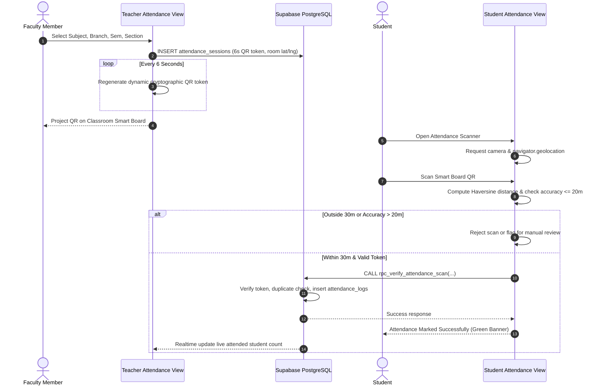

# HIET Digital Campus — End-to-End User Workflows & Data Flows
**Himachal Institute of Engineering & Technology, Shahpur (Kangra, H.P.)**  
**Document Ref:** `docs/project-understanding/04-user-workflows.md`

---

## 1. Overview of Workflow Architecture
HIET Digital Campus me sabhi academic aur administrative processes lifecycle-driven workflows ke form me structured hain. Har workflow me state transitions, role-scoped actions, database notifications aur audit logging integrated hai.

Is document me sabhi 19 major user workflows ka detailed flow, database operations, RLS checks aur implementation status explain kiya gaya hai.

---

## 2. Core User Workflows Step-by-Step

### Workflow 1: Dynamic Classroom QR Attendance
**Goal:** Classroom roll-call proxy eliminate karna aur 30-meter geofenced verified presence ensure karna.



- **Starting Point:** Faculty opens `/app/attendance` (`TeacherAttendanceView.tsx`).
- **Form Fields:** Subject Code, Branch, Semester, Section, Classroom coordinates (`32.2190000 N, 76.2708000 E`).
- **Database Tables:** `attendance_sessions`, `attendance_logs`, `attendance_records`, `device_fingerprints`.
- **Backend Function:** `public.rpc_verify_attendance_scan(...)` (`supabase/migrations/20261007000022_create_views_and_rpc.sql`).
- **Code Locations:** `src/lib/attendanceService.ts`, `src/components/teacher/TeacherAttendanceView.tsx`, `src/components/student/AttendanceView.tsx`.
- **Working Status:** ✅ Fully Working in local/preview. 🟡 Partially Working on real physical devices inside thick concrete buildings due to GPS drift.

---

### Workflow 2: Multi-Stage Leave Approval Engine
**Goal:** Student leave application ko uski duration ke mutabiq sahi authority tak auto-route karna.

```mermaid
graph TD
    A[Student Submits Leave Request] -->|total_days <= 2| B(Class In-Charge Review)
    A -->|3 <= total_days <= 6| C(Department HOD Review)
    A -->|total_days >= 7| D(Principal Review)
    
    B -->|Approve Short Leave| E[Status: Approved (Final)]
    B -->|Reject| F[Status: Rejected]
    B -->|Needs Escalation| C
    
    C -->|Approve Dept Leave| E
    C -->|Reject| F
    C -->|Extended Medical/Duty| D
    
    D -->|Principal Sanction| E
    D -->|Reject| F
    
    subgraph MultiRoleSafeguard [Faculty & HOD Role Held by Same User]
        G[Faculty Approves] -.->|v_dept_hod_user_id == v_user_id| E
    end
```

- **Starting Point:** Student opens `/app/leave` (`LeaveApplicationView.tsx`).
- **Form Fields:** Leave Type (Medical/Casual/Duty), Start Date, End Date, Reason, Document Attachment.
- **Calculation:** `total_days = (end_date - start_date) + 1` via `calculateLeaveDays()`.
- **Threshold Routing (Configured in `leave_workflow_config`):**
  - `<= 2 days`: Class In-Charge / Faculty directly sanctions.
  - `3 to 6 days`: Routed to Department HOD (`status = 'pending_hod'`, `stage = 'hod'`).
  - `>= 7 days`: Routed to Principal (`status = 'pending_principal'`, `stage = 'principal'`).
- **Multi-Role Conflict Rule (Option A):** Agar Faculty member hi Department HOD ho (`v_dept_hod_user_id = v_user_id`), toh duplicate HOD stage skip hoti hai aur status directly `approved` ho jata hai.
- **Database Action:**
  - `leave_requests` status update.
  - `leave_request_history` insert audit action (`forwarded_to_hod`, `approved`, `rejected`).
  - `notifications` insert for student.
- **Backend RPC:** `public.process_leave_action_rpc(...)` (`20261008000005_fix_leave_workflow_stages.sql`).
- **Working Status:** ✅ Fully Working.

---

### Workflow 3: Dual-Role Workspace Switching (Faculty ⮂ HOD)
**Goal:** Single user ko bina logout kiye teaching aur departmental leadership views ke beech switch karne ki suvidha dena.

```text
User logs in (anuj.sharma@hiet.demo / HIET-FAC-CSE-001)
  │
  ▼
AuthContext detects activeRoles: ['faculty', 'hod']
  │
  ├── User clicks [ 🏛️ HOD — CSE ] in Navbar
  │     │
  │     ▼
  │   switchWorkspace('hod')
  │     ├── Updates React state: activeWorkspaceRole = 'hod'
  │     ├── Updates LocalStorage: hiet_active_workspace_role = 'hod'
  │     ├── Updates Supabase: user_workspace_preferences.active_workspace_role_key = 'hod'
  │     └── Updates URL: window.history.replaceState(null, '', '/app/hod')
  │     │
  │     ▼
  │   Sidebar re-renders HOD Navigation (Department, Syllabus Progress, Approvals)
  │   Main content renders <HodDashboard />
  │
  └── User clicks [ 🎓 Faculty Workspace ] in Navbar
        │
        ▼
      switchWorkspace('faculty')
        ├── Updates state, storage, and URL to '/app/faculty'
        └── Sidebar re-renders Faculty Navigation (Timetable, Dynamic Attendance, Assignments)
```

- **Starting Point:** Navbar header pill (`src/components/common/Navbar.tsx`).
- **Code Location:** `src/context/AuthContext.tsx` (L1043–1070).
- **Security Check:** Switching only toggles UI view; user permissions are backed by PostgreSQL `user_roles` records, so an unauthorized user cannot grant themselves HOD privileges.
- **Working Status:** ✅ Fully Working.

---

### Workflow 4: Smart Board Whiteboard Session & Syllabus Synchronization
**Goal:** Smart classroom me lecture lene ke baad interactive notes upload karna aur syllabus coverage ko real-time update karna.

```text
1. Faculty starts interactive session on classroom smart board:
   - Selects Subject (e.g. CS-601: Software Engineering)
   - Selects Unit (e.g. Unit 2) & enters Topic Name (e.g. "Agile Sprint Planning")
   - Starts lecture timer.
2. Faculty delivers lecture, writes diagrams on smart board.
3. At lecture end:
   - Faculty exports whiteboard PDF / slides.
   - Clicks "Save & Synchronize Lesson".
4. Database Action:
   - INSERT into smart_board_lessons (duration, summary, whiteboard file url, sync_status = 'Synced').
   - Syllabus topic completion tracker marks topic as covered.
5. Immediate Result:
   - HOD dashboard "Smart Board Activity" shows new lesson entry.
   - Student Syllabus progress bar increases.
```

- **Component:** `src/components/smartboard/SmartBoardTeachingView.tsx`.
- **Database Tables:** `smart_board_lessons`, `syllabus`, `subjects`.
- **Working Status:** ✅ Fully Working for lesson logging and syllabus sync. 🟠 AI summary uses rule-based keywords when LLM keys are absent.

---

### Workflow 5: Digital Gate Pass & Security Guard Verification
**Goal:** College campus se official exit ke liye digital QR pass generate aur gate par scan karna.

```text
Student requests Gate Pass (/app/gate-pass)
  ├── Reason: "Bank Work / Emergency"
  ├── Time: Exit 02:00 PM - Return 05:00 PM
  └── Token generated: HIET-GP-TOKEN-XXXX with QR Code
         │
         ▼
Student arrives at Main Gate and presents QR on mobile
         │
         ▼
Security Guard scans QR via camera (/app/scan -> SecurityScannerView.tsx)
         │
         ▼
Backend RPC: rpc_verify_gate_pass(token, gate_name, 'exit')
  ├── Validates token expiry & single-use policy
  ├── Logs entry into gate_entries table (actual_exit_time = now())
  └── Updates Gate Pass status to 'used'
         │
         ▼
Security Guard screen displays Green Verification Badge with Student Name & Photo
```

- **Component:** `src/components/student/DigitalGatePassView.tsx`, `src/components/security/SecurityScannerView.tsx`.
- **Database Tables:** `gate_passes`, `gate_entries`.
- **Backend Function:** `public.rpc_verify_gate_pass(...)` (`20261007000022_create_views_and_rpc.sql`).
- **Working Status:** ✅ Fully Working.

---

### Workflow 6: LMS Assignment Lifecycle (Create ➔ Submit ➔ Grade)
**Goal:** Paperless coursework submission aur grading pipeline.

```text
Step 1: Faculty creates Assignment (/app/assignments)
  ├── Title, Description, Subject, Deadline, Total Marks (e.g. 100), Attachment
  └── INSERT into assignments table

Step 2: Student receives notification & views assignment (/app/assignments)
  ├── Downloads instructions
  ├── Uploads submission PDF/DOCX
  └── INSERT into assignment_submissions (status = 'submitted', submitted_at = now())

Step 3: Faculty grades submission (/app/submissions)
  ├── Reviews student file
  ├── Enters Marks Awarded (e.g. 88/100) and Feedback comments
  └── UPDATE assignment_submissions (status = 'graded', marks_awarded = 88)

Step 4: Student view updates
  └── Displays graded marks and faculty remarks
```

- **Components:** `src/components/teacher/TeacherAssignmentsView.tsx`, `src/components/student/StudentAssignmentsView.tsx`.
- **Database Tables:** `assignments`, `assignment_submissions`.
- **Storage Bucket:** `assignment-submissions` (Private).
- **Working Status:** ✅ Fully Working.

---

### Workflow 7: Master Data Import (Bulk Onboarding of 5,000+ Students)
**Goal:** Academic session start hone par Excel sheet se students, teachers aur timetables ko bina database crash kiye import karna.

```text
1. Principal / Admin uploads XLSX file at /app/import (MasterDataImportView.tsx).
2. Client-side SheetJS (xlsx) parses rows.
3. ImportValidation.ts runs strict schema checks:
   - Roll number format regex check.
   - Valid department & semester check.
   - Email format check.
4. "Dry Run" mode validates entire dataset without committing:
   - Flags duplicate roll numbers or missing columns.
5. On final confirmation:
   - Calls atomic RPC: process_master_import_atomic(...)
   - Runs in single PostgreSQL transaction.
   - If any critical constraint fails, entire batch rolls back safely.
6. Job status saved in import_jobs with detailed error log in import_errors.
```

- **Component:** `src/components/admin/MasterDataImportView.tsx`.
- **Database Tables:** `import_jobs`, `import_errors`, `students_master`, `teachers_master`.
- **Backend Function:** `public.process_master_import_atomic(...)` (`20261008000007_real_data_import_and_onboarding.sql`).
- **Working Status:** ✅ Fully Working.

---

### Workflow 8: Academic Doubt Box (Student Query ➔ Faculty Reply)
- **Step 1:** Student opens `/app/doubts` (`DoubtBoxView.tsx`), selects subject, enters question, and optionally attaches problem screenshot.
- **Step 2:** System inserts record into `doubts` table; subject teacher receives in-app alert.
- **Step 3:** Faculty opens `/app/doubts` (`TeacherDoubtsView.tsx`), writes detailed clarification, and posts reply.
- **Step 4:** Doubt thread updates; student marks query as "Resolved".
- **Working Status:** ✅ Fully Working.

---

### Workflow 9: Student Grievance / Complaint SLA Routing
- **Step 1:** Student submits complaint at `/app/complaints` (`ComplaintBoxView.tsx`) with category (Academics, Hostel, Mess, Infrastructure, Anti-Ragging) and privacy preference (Identified or Anonymous).
- **Step 2:** Record inserted in `complaints` table with initial status `'Pending'`.
- **Step 3:** Assigned HOD / Committee head investigates issue, adds official resolution notes, and marks status `'Resolved'`.
- **Working Status:** ✅ Fully Working.

---

### Workflow 10: Campus AI Assistant Query Handling
- **Step 1:** User opens AI Assistant modal via Navbar button.
- **Step 2:** User inputs query in English, Hindi, or Hinglish (e.g., *"Meri attendance kitni hai?"*).
- **Step 3:** Deterministic intent router (`detectAssistantIntent` in `assistantIntents.ts`) maps query to `my_attendance` without getting trapped by generic question words.
- **Step 4:** If Supabase Edge Function is reachable and LLM key is configured, Gemini/OpenAI synthesizes natural response.
- **Step 5:** If key is not configured or network drops, dynamic fallback engine extracts live student attendance records and returns accurate percentage, attended count, and statutory shortage warning.
- **Working Status:** 🟡 Partially Working (Intent routing & dynamic local fallback work perfectly; external cloud LLM depends on Supabase Secrets).
