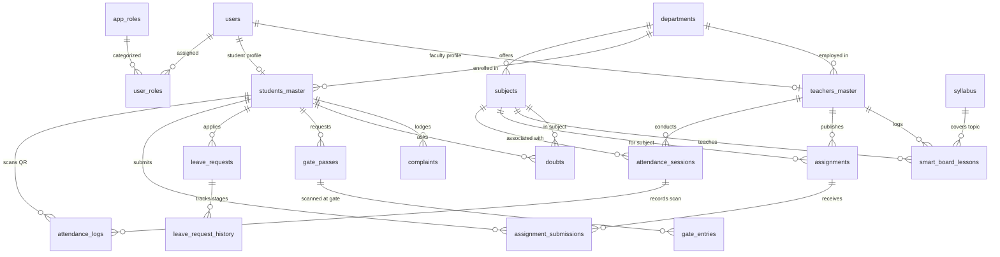

# HIET Digital Campus — Database Schema & Supabase Architecture
**Himachal Institute of Engineering & Technology, Shahpur (Kangra, H.P.)**  
**Document Ref:** `docs/project-understanding/06-database-and-supabase.md`

---

## 1. Database Architecture Overview

HIET Digital Campus ka relational backend **Supabase Managed PostgreSQL 15+** par structured hai. Database schema 44 migrations me organize kiya gaya hai (`supabase/migrations/`):
- Extensions: `uuid-ossp`, `pgcrypto`, optional `vector` (pgvector).
- Granular Security: Sabhi institutional tables par **Row Level Security (RLS)** enabled hai.
- Multi-Role Support: Canonical user profiles `public.users` me hain, aur unke assigned roles `public.user_roles` me link hote hain.
- Institutional Safety: Stored procedures (`SECURITY DEFINER`) ke sath fixed `search_path = public` enforced hai taaki SQL injection aur search-path poisoning prevent ho sake.

---

## 2. Complete Database Tables Inventory

| Table Name | Purpose & Description | Used By Feature | Key Fields | RLS | Data State | Status |
|---|---|---|---|:---:|:---:|:---:|
| `users` | Canonical institutional users table linked to Supabase Auth (`supabase_auth_id`). | Auth, Profiles, Directory | `id`, `supabase_auth_id`, `email`, `role`, `department_id`, `is_active` | ✅ Yes | Real + Seed | Verified |
| `app_roles` | Master directory of 15 institutional system roles and their hierarchy levels. | Multi-Role Engine | `role_id`, `role_key`, `role_name`, `hierarchy_level`, `is_active` | ✅ Yes | Seeded | Verified |
| `user_roles` | Multi-role assignment junction table (links users to multiple active roles). | Multi-Role Authorization | `user_role_id`, `user_id`, `role_id`, `department_id`, `is_active` | ✅ Yes | Seeded | Verified |
| `user_workspace_preferences`| Remembers active UI workspace (e.g. Faculty vs HOD) across user sessions. | Workspace Switcher | `user_id`, `active_workspace_role_key`, `active_department_id` | ✅ Yes | Active | Verified |
| `departments` | Engineering and institutional departments (CSE, ECE, Civil, Mechanical, AS&H).| Academic Structure | `id`, `name`, `code`, `hod_id`, `is_active` | ✅ Yes | Real + Seed | Verified |
| `department_hod_assignments`| Official appointment records of Department Heads by the Principal. | HOD Governance | `assignment_id`, `department_id`, `faculty_user_id`, `effective_from` | ✅ Yes | Seeded | Verified |
| `class_incharges` | Semester-section mentor assignments for short leave routing. | Class In-Charge Mentorship | `id`, `department_code`, `semester`, `section`, `employee_code` | ✅ Yes | Active | Verified |
| `students_master` | College master admissions record for students before/after portal signup. | Admissions, Verification | `id`, `roll_no`, `name`, `college_email`, `department`, `semester`, `section`| ✅ Yes | Real + Seed | Verified |
| `teachers_master` | College master faculty registry with employee codes and designations. | Faculty Verification | `id`, `faculty_id`, `full_name`, `college_email`, `department`, `is_hod` | ✅ Yes | Real + Seed | Verified |
| `subjects` | Master catalog of courses, syllabus codes, credits, and teaching hours. | Academic Catalog | `id`, `name`, `code`, `department_id`, `semester`, `credits` | ✅ Yes | Real + Seed | Verified |
| `subject_assignments` | Faculty-to-subject and section teaching assignment mappings. | Subject Allocation | `id`, `teacher_id`, `subject_id`, `academic_year`, `section` | ✅ Yes | Active | Verified |
| `timetables` | Weekly lecture timetable slots (Monday to Friday, periods 1–8). | Timetable View | `id`, `subject_id`, `teacher_id`, `day_of_week`, `start_time`, `end_time` | ✅ Yes | Real + Seed | Verified |
| `attendance_sessions` | Faculty classroom attendance sessions with 6s dynamic QR tokens & geofence. | QR Attendance Generator | `id`, `teacher_id`, `subject_id`, `current_qr_token`, `latitude`, `longitude`| ✅ Yes | Active | Verified |
| `attendance_logs` | Raw hardware scan logs submitted by students with coordinates and flags. | Scanner Verification | `id`, `session_id`, `student_id`, `verification_status`, `distance_meters` | ✅ Yes | Active | Verified |
| `attendance_records` | Aggregated student session attendance status (Present, Absent, Leave). | Attendance History | `id`, `student_id`, `subject_id`, `date`, `status`, `marked_by` | ✅ Yes | Active | Verified |
| `attendance_risk_assessments`| Forecasted student attendance shortage risks and statutory recovery targets. | AI Attendance Insights | `assessment_id`, `student_id`, `subject_id`, `risk_level`, `classes_needed` | ✅ Yes | Seeded | Verified |
| `syllabus` | Unit-wise syllabus modules, topics, and completion status. | Syllabus Tracker | `id`, `subject_id`, `unit_number`, `unit_title`, `is_completed` | ✅ Yes | Active | Verified |
| `pyqs` | Previous year university examination papers with question paper PDF links. | PYQ Hub | `id`, `subject_id`, `year`, `semester`, `exam_type`, `file_url` | ✅ Yes | Active | Verified |
| `assignments` | Coursework homework tasks published by faculty with deadlines and marks. | LMS Assignments | `id`, `teacher_id`, `subject_id`, `title`, `deadline`, `total_marks` | ✅ Yes | Active | Verified |
| `assignment_submissions` | Student homework file uploads, submission timestamps, grades, and feedback. | LMS Grading | `id`, `assignment_id`, `student_id`, `submission_url`, `marks_awarded` | ✅ Yes | Active | Verified |
| `sessional_marks` | Internal examination marks (Sessional 1, Sessional 2, internal assessment). | Sessional Marks Card | `id`, `student_id`, `subject_id`, `sessional_1`, `sessional_2`, `internal` | ✅ Yes | Active | Verified |
| `grades` | Semester grade cards, credits, SGPA, and cumulative CGPA. | Results & CGPA | `id`, `student_id`, `semester`, `sgpa`, `cgpa`, `status` | ✅ Yes | Active | Verified |
| `leave_requests` | Student leave applications with start/end date, stages, and approvals. | Multi-Stage Leave Workflow | `id`, `student_id`, `total_days`, `status`, `current_stage`, `current_assignee`| ✅ Yes | Active | Verified |
| `leave_request_history` | Complete historical audit log of every leave forward/sanction action. | Leave Timeline | `history_id`, `leave_id`, `action_key`, `from_status`, `to_status`, `remarks` | ✅ Yes | Active | Verified |
| `leave_workflow_config` | Department-level day thresholds for Class Incharge, HOD, and Principal routing. | Leave Rule Configuration | `config_id`, `short_leave_max_days`, `hod_required_after_days`, `is_active` | ✅ Yes | Seeded | Verified |
| `complaints` | Student grievance tickets with category, priority, and resolution remarks. | Grievance Box | `id`, `student_id`, `category`, `description`, `is_anonymous`, `status` | ✅ Yes | Active | Verified |
| `doubts` | Academic question-and-answer threads between students and subject faculty. | Doubt Box | `id`, `student_id`, `subject_id`, `question`, `answer`, `status` | ✅ Yes | Active | Verified |
| `achievements` | Student sports, hackathon, and co-curricular certificates for verification. | Achievements Desk | `id`, `student_id`, `title`, `category`, `certificate_url`, `status` | ✅ Yes | Active | Verified |
| `gate_passes` | Day pass exit slips with QR verification tokens and validity windows. | Digital Gate Pass | `id`, `student_id`, `exit_time`, `expected_return_time`, `qr_token`, `status` | ✅ Yes | Active | Verified |
| `gate_entries` | Main gate hardware/guard entry and exit physical verification timestamps. | Security Reconciliation | `id`, `pass_id`, `gate_name`, `action`, `verified_by_guard_id`, `timestamp` | ✅ Yes | Active | Verified |
| `hostel_outpasses` | Overnight hostel leave requests requiring warden authorization. | Hostel Outpass | `id`, `student_id`, `hostel_code`, `parent_contact`, `status`, `warden_id` | ✅ Yes | Active | Verified |
| `campus_presence` | Zone-level presence events with voluntary check-in method and confidence. | Campus Presence | `id`, `user_id`, `zone_id`, `detection_method`, `confidence_score` | ✅ Yes | Active | Verified |
| `smart_board_lessons` | Smart classroom whiteboard lecture logs, whiteboard exports, and syllabus link. | Smart Board Tracker | `id`, `teacher_id`, `subject_id`, `unit_id`, `topic_id`, `duration_minutes` | ✅ Yes | Active | Verified |
| `notifications` | In-app user notifications for leaves, doubts, circulars, and approvals. | Notification Bell | `id`, `user_id`, `title`, `message`, `type`, `link_url`, `is_read` | ✅ Yes | Active | Verified |
| `workflow_actions` | Generic audit lifecycle tracking table for multi-role operations. | Operational Audit | `action_id`, `entity_type`, `entity_id`, `action_key`, `performed_by` | ✅ Yes | Active | Verified |
| `audit_logs` | Immutable institutional ledger of administrative data modifications. | Administrative Audit | `id`, `user_id`, `action`, `resource_type`, `resource_id`, `ip_address` | ✅ Yes | Active | Verified |
| `import_jobs` | Tracking table for bulk XLSX/CSV master import jobs. | Master Data Import | `job_id`, `target_entity`, `status`, `total_rows`, `processed_rows` | ✅ Yes | Active | Verified |
| `import_errors` | Line-by-line validation errors from rejected master import rows. | Import Error Reporting | `id`, `job_id`, `row_number`, `column_name`, `invalid_value`, `reason` | ✅ Yes | Active | Verified |
| `campus_buildings` | Campus physical building registry with geographic coordinates. | AI Campus Phase 2 | `building_id`, `building_code`, `building_name`, `latitude`, `longitude` | ✅ Yes | Seeded | Verified |
| `campus_floors` | Building floor layout directory. | AI Campus Phase 2 | `floor_id`, `building_id`, `floor_number`, `floor_name` | ✅ Yes | Seeded | Verified |
| `campus_zones` | Granular campus operational zones (Classrooms, Labs, Library, Canteen, Gates). | AI Campus Phase 2 | `zone_id`, `building_id`, `floor_id`, `zone_code`, `zone_name`, `zone_type` | ✅ Yes | Seeded | Verified |
| `zone_qr_tokens` | Fixed public QR check-in tokens for physical wall posters. | Zone Presence | `zone_qr_id`, `zone_id`, `public_token`, `is_dynamic`, `is_active` | ✅ Yes | Seeded | Verified |
| `ble_beacons` | Hardware BLE iBeacon registry with UUID, Major, Minor, and TxPower metrics. | BLE Pilot Roadmap | `beacon_id`, `zone_id`, `beacon_code`, `uuid_value`, `major_value`, `minor` | ✅ Yes | Seeded | Verified |
| `presence_events` | Privacy-preserving voluntary presence check-in logs (Zero continuous tracking).| Presence Analytics | `presence_event_id`, `user_id`, `zone_id`, `detection_method`, `confidence` | ✅ Yes | Active | Verified |
| `occupancy_devices` | Anonymous edge crowd-counting gateway devices (Raspberry Pi/Jetson). | Occupancy Analytics | `device_id`, `device_code`, `zone_id`, `device_type`, `is_active` | ✅ Yes | Seeded | Verified |
| `occupancy_events` | Aggregate person head-counts only (Zero facial biometric data stored). | Crowd Monitoring | `occupancy_event_id`, `device_id`, `zone_id`, `person_count`, `crowd_level` | ✅ Yes | Seeded | Verified |
| `waste_bin_devices` | Integration-ready smart recycling bin hardware registry. | Smart Waste Roadmap | `waste_device_id`, `device_code`, `zone_id`, `device_name`, `is_active` | ✅ Yes | Seeded | Verified |
| `waste_bin_events` | Bin depth and waste material fill percentage telemetry. | Sanitation Roadmap | `waste_event_id`, `waste_device_id`, `waste_category`, `fill_level_percentage`| ✅ Yes | Seeded | Verified |
| `knowledge_documents` | Curated official institutional PDFs and circulars for AI document grounding. | Knowledge Search | `document_id`, `title`, `source_type`, `department_id`, `is_published` | ✅ Yes | Seeded | Verified |
| `knowledge_chunks` | Chunked text passages with 384-dimensional vector embeddings for AI lookup. | AI Semantic Search | `chunk_id`, `document_id`, `chunk_index`, `content`, `embedding` | ✅ Yes | Seeded | Verified |
| `no_dues_records` | Student clearance master record for final semester clearance. | Clearance Desk | `id`, `student_id`, `academic_year`, `overall_status`, `remarks` | ✅ Yes | Active | Verified |
| `no_dues_clearances`| Departmental clearance signoffs (Library, Hostel, Accounts, Labs, Sports). | No-Dues Desk | `id`, `record_id`, `department_name`, `status`, `cleared_by`, `cleared_at` | ✅ Yes | Active | Verified |
| `hall_tickets` | Official semester examination hall tickets with tamper-evident QR tokens. | Exam Hall Tickets | `id`, `student_id`, `exam_name`, `verification_token`, `is_valid` | ✅ Yes | Active | Verified |
| `events` | Co-curricular technical, sports, and cultural college fests directory. | Events Desk | `id`, `title`, `category`, `event_date`, `venue`, `status` | ✅ Yes | Active | Verified |
| `event_certificates`| Official digitally verifiable event merit and participation certificates. | Certificate Verification | `id`, `event_id`, `student_id`, `certificate_number`, `verification_token` | ✅ Yes | Active | Verified |
| `maintenance_tickets`| Campus infrastructure defect and repair tickets. | Maintenance Grievance | `id`, `title`, `category`, `priority`, `status`, `reported_by`, `assigned_to` | ✅ Yes | Active | Verified |
| `lost_found_items` | Campus lost and found items catalog with anti-theft challenge questions. | Lost & Found Desk | `id`, `title`, `category`, `description`, `found_location`, `status` | ✅ Yes | Active | Verified |
| `lost_found_claims` | Student claims with answer verification for lost items. | Lost & Found Claims | `id`, `item_id`, `claimant_id`, `submitted_answer`, `is_answer_correct` | ✅ Yes | Active | Verified |

---

### Audit of Requested Tables Not Found:
- `ai_interactions`: **Not present in current database schema.** AI chat conversations are managed client-side in React state (`useCampusAssistant.ts`) or logged via audit events (`presence_events`), without persistent personal chat logging.
- `faculty_master`: Table is named `teachers_master` in the database schema.
- `gate_pass_logs`: Table is named `gate_entries` in the database schema.
- `class_incharge_assignments`: Table is named `class_incharges` in migration 37.

---

## 3. Entity-Relationship (ER) Diagram (Verified Foreign Keys)

