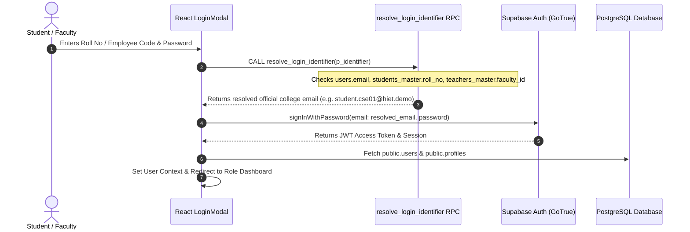

# HIET Digital Campus — Authentication, Security & Row Level Security (RLS)
**Himachal Institute of Engineering & Technology, Shahpur (Kangra, H.P.)**  
**Document Ref:** `docs/project-understanding/07-auth-security-rls.md`

---

## 1. Authentication Architecture

### A. Identifier Resolution Flow (Email / Roll No / Employee Code)
Traditional web apps sirf email login support karti hain, lekin HIET Digital Campus me students apne **University Roll Number** (e.g. `HIET-CSE-2026-001`) se aur teachers apne **Employee Code** (e.g. `HIET-FAC-CSE-001`) se login kar sakte hain:



- **Backend Function:** `public.resolve_login_identifier(TEXT)` (`supabase/migrations/20261007000027_fix_auth_role_mapping.sql`).
- **Security Guard:** Function runs with `SECURITY DEFINER` and fixed `search_path = public, auth`. Yeh function user ke password hashes ya private tokens ko kabhi return nahi karta, sirf institutional email return karta hai.

---

### B. User Identity Mapping (`auth.users` ➔ `public.users` ➔ `profiles`)

1. **`auth.users`:** Supabase internal authentication table jo encrypted passwords, JWT tokens aur email verification handle karta hai.
2. **`public.users`:** Application user identity table:
   - Linked via `supabase_auth_id = auth.users.id`.
   - Stores authoritative `role`, `department_id`, and `is_active` flag.
3. **`public.profiles`:** View/cache table jo UI components me render hota hai:
   - Database trigger `trg_sync_user_profile` har `users` insert/update par automatic profile record maintain karta hai.
   - Profile join karta hai `students_master` ya `teachers_master` ke sath user ki batch, semester aur designation fetch karne ke liye.

---

## 2. Multi-Role Authorization & Workspace Switcher Security

- **Database Multi-Role Design:**
  - Table `public.app_roles`: 15 institutional roles (`student`, `faculty`, `class_incharge`, `hod`, `principal`, `managing_director`, `security`, `warden`, `library_staff`, `lab_staff`, `it_staff`, etc.).
  - Junction Table `public.user_roles`: Maps `user_id` to multiple `role_id` entries.
- **Can Workspace Switcher Grant Fake Permissions?**
  - **NO.** Workspace switcher (`switchWorkspace` in `AuthContext.tsx`) sirf client-side active dashboard view aur UI navigation toggle karta hai.
  - Jab user koi database action perform karta hai (e.g. approving a leave, viewing audit logs, ya modifying marks), PostgreSQL RLS user ke active session JWT (`auth.uid()`) aur database table `user_roles` se permissions evaluate karta hai.
  - Agar ek regular student client state me `role = 'hod'` manipulate bhi kar le, tab bhi Supabase RLS policies sabhi queries par `403 Forbidden / empty set` return karengi.

---

## 3. Data Access Security Matrix

| Data Domain | Student | Faculty | Class In-Charge | HOD | Principal | Security | MD | Code Evidence |
|---|:---:|:---:|:---:|:---:|:---:|:---:|:---:|---|
| **Own Attendance History** | ✅ Full | ✅ Full | ✅ Full | ✅ Full | ✅ Full | ❌ No | ❌ No | `p_att_logs_select`: `student_id = current_student_id()` |
| **Peer Attendance Data** | ❌ Blocked | ❌ Blocked | ❌ Blocked | ❌ Blocked | ✅ Full | ❌ No | ✅ Full | Enforced via RLS in `20261007000024_create_rls_policies.sql` |
| **Classroom Scan Creation** | ❌ Blocked | ✅ Assigned | ✅ Assigned | ✅ Dept | ✅ College | ❌ Blocked | ❌ Blocked | `p_att_sessions_faculty`: `teacher_id = current_faculty_id()` |
| **Sessional Marks Entry** | ❌ Blocked | ✅ Assigned | ✅ Assigned | ✅ Dept | ✅ College | ❌ Blocked | ❌ Blocked | `p_marks_modify`: `is_faculty() OR is_principal()` |
| **Student Marks View** | ✅ Own Only| ✅ Assigned | ✅ Assigned | ✅ Dept | ✅ College | ❌ Blocked | ✅ Aggregate | `p_marks_select`: `student_id = current_student_id() OR is_faculty()` |
| **Short Leave Sanction (<=2d)**| ❌ Blocked | ❌ Blocked | ✅ Section | ✅ Dept | ✅ College | ❌ Blocked | ❌ Blocked | `process_leave_action_rpc` stage evaluation |
| **Dept Leave Sanction (3-6d)** | ❌ Blocked | ❌ Blocked | ❌ Blocked | ✅ Dept | ✅ College | ❌ Blocked | ❌ Blocked | `process_leave_action_rpc` HOD stage check |
| **Extended Leave (7+ days)** | ❌ Blocked | ❌ Blocked | ❌ Blocked | ❌ Blocked | ✅ College | ❌ Blocked | ❌ Blocked | `process_leave_action_rpc` Principal check |
| **Student Doubts Threads** | ✅ Own Only| ✅ Assigned | ✅ Assigned | ✅ Dept | ✅ College | ❌ Blocked | ❌ Blocked | `p_doubts_select`: `is_faculty_assigned_to_subject()` |
| **Grievance / Complaints** | ✅ Own Only| ❌ Blocked | ❌ Blocked | ✅ Dept | ✅ College | ❌ Blocked | ❌ Blocked | `p_complaints_select`: Student own OR Principal OR HOD |
| **Gate Pass QR Scan** | ❌ Blocked | ❌ Blocked | ❌ Blocked | ❌ Blocked | ✅ College | ✅ Scan Only| ❌ Blocked | `p_gate_passes_select`: Role `'security'` or Principal |
| **Hostel Outpass Sanction** | ❌ Blocked | ❌ Blocked | ❌ Blocked | ❌ Blocked | ✅ College | ❌ Blocked | ❌ Blocked | `p_outpasses_warden`: Role `'warden'` or Principal |
| **Master Excel Import** | ❌ Blocked | ❌ Blocked | ❌ Blocked | ❌ Blocked | ✅ College | ❌ Blocked | ❌ Blocked | `process_master_import_atomic`: Principal only |
| **Institutional Audit Logs** | ❌ Blocked | ❌ Blocked | ❌ Blocked | ❌ Blocked | ✅ Read Only| ❌ Blocked | ✅ Read Only| `p_audit_logs_select`: `is_principal() OR is_managing_director()` |

---

## 4. Storage Bucket Security & Access Policies

Supabase storage me 12 buckets configured hain (`supabase/migrations/20261007000025_create_storage_buckets_policies.sql`):
- **Public Buckets (`public = true`):**
  - `gallery-images`: Public read access for institutional promotional photos.
  - `public-notices`: Public read access for official examination/holiday circulars.
- **Private Buckets (`public = false`):**
  - `assignment-submissions`, `leave-documents`, `achievement-certificates`, `smart-board-lessons`, `pyq-files`, `syllabus-files`, `complaint-attachments`, `doubt-attachments`, `hall-tickets`, `event-certificates`.

### Critical Storage Security Finding:
> [!WARNING]
> Migration `20261007000025_create_storage_buckets_policies.sql` line 48–53 reads:
> ```sql
> CREATE POLICY p_storage_auth_read ON storage.objects
>     FOR SELECT TO authenticated
>     USING (
>         bucket_id IN ('gallery-images', 'public-notices')
>         OR (auth.uid() IS NOT NULL)
>     );
> ```
> **Risk Explanation:** Private buckets ka SELECT rule `auth.uid() IS NOT NULL` hai. Iska matlab koi bhi logged-in user (chahe student ho) agar doosre student ki private assignment submission ya medical certificate ka exact path guess kar le, toh Supabase Storage API direct read allow kar sakti hai.  
> **Recommended Fix:** Storage SELECT policy ko path-scoped banaya jaye: `(storage.foldername(name))[1] = auth.uid()::text OR is_faculty() OR is_principal()`.

---

## 5. Secrets Protection & Edge Security

1. **Service Role Key:**
   - Codebase me kahi bhi `SUPABASE_SERVICE_ROLE_KEY` frontend bundle me bundled nahi hai (`.env` only contains `VITE_SUPABASE_ANON_KEY`).
   - Anon key client-side public access ke liye safe hai kyunki RLS policies database layer par strictly protect karti hain.
2. **AI Provider API Keys:**
   - OpenAI aur Google Gemini API keys frontend `.env` me nahi rakhi gayi hain.
   - Keys Supabase Edge Secrets (`OPENAI_API_KEY`, `GEMINI_API_KEY`) me serve hoti hain jo client browser ko kabhi expose nahi hoti.
3. **Atomic RPC Security:**
   - Sabhi critical functions (`process_leave_action_rpc`, `rpc_verify_attendance_scan`, `process_master_import_atomic`, `resolve_login_identifier`) `SECURITY DEFINER` ke sath `SET search_path = public, auth` use karte hain. Isse search-path hijacking attacks completely prevent hote hain.
