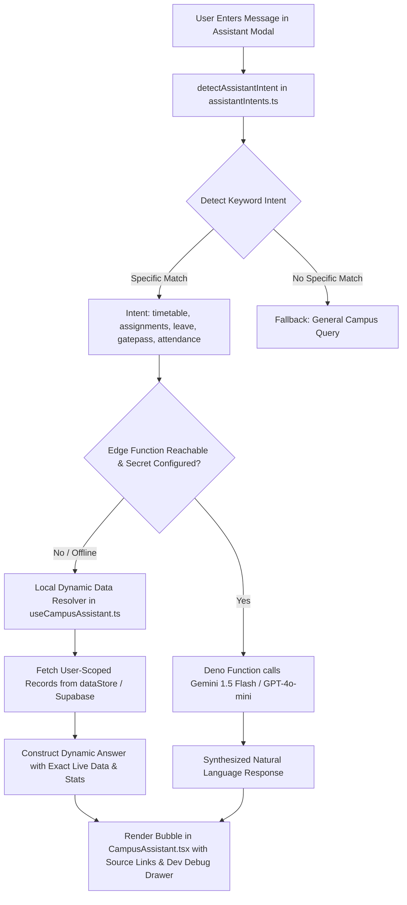

# HIET Digital Campus — AI Campus Features Status & Assistant Audit
**Himachal Institute of Engineering & Technology, Shahpur (Kangra, H.P.)**  
**Document Ref:** `docs/project-understanding/10-ai-features-status.md`

---

## 1. AI Campus Strategy & Phases Overview

HIET Digital Campus me AI features ko 3 sequential phases me architect kiya gaya hai (`src/config/aiFeatures.ts`):
- **Phase 1 (Academic & Routine Intelligence):** Campus AI Assistant, Attendance Risk Alerts, Smart Board Summaries, Complaint Routing.
- **Phase 2 (Smart Infrastructure & Presence):** QR Zone Check-In, BLE Floor Pilot, AI Document Search, Occupancy Analytics, Smart Waste Sensors.
- **Phase 3 (Predictive Institutional Analytics):** Curriculum Optimization, Attrition Prevention.

---

## 2. Deep-Dive: Campus AI Assistant & "Repeated-Answer" Bug Analysis

### A. Problem Statement (Original Bug)
Pehle users ne notice kiya tha ki jab student AI Assistant se alag-alag sawaal poochte the:
- *"Meri attendance kitni hai?"*
- *"Meri next class kab hai?"*
- *"Meri leave ka status kya hai?"*
Toh assistant har sawaal par ek hi generic static response repeat karta tha.

---

### B. Root Causes Identified (Technical Investigation):

1. **Greedy Keyword Matching on Hindi Token *"Kitni" / "Kitne"*:**
   - Heuristic parser me token `"kitni"` ko directly `my_attendance` intent se map kar diya gaya tha.
   - Hindi/Hinglish me students har cheez me *"kitni"* lagate hain (e.g. *"Class kitni baje hai?"*, *"Leave kitni bachi hain?"*, *"Kitne assignment pending hain?"*).
   - Har query pehle hi line par `my_attendance` ban jati thi!
2. **Payload Parameter Key Mismatch:**
   - Frontend `{ query: string }` bhej raha tha jabki Edge Function `{ message: string }` expect kar raha tha. Mismatch hone par `message` undefined ho jata tha aur guard clause trigger hokar static error template return kar deta tha.
3. **Hardcoded Fallback Template:**
   - External LLM provider (`GEMINI_API_KEY` / `OPENAI_API_KEY`) agar Supabase Secrets me na mile, toh system ek hi hardcoded string return kar raha tha:  
     *"Your current Engineering Mathematics-I attendance is 70.59%..."*
   - Har role aur har sawaal ke liye yahi ek sentence repeat hota tha.

---

### C. Architecture Fix Implemented in Codebase:

#### Verification After Fixes:
1. **Contract Standardized:** Both client and edge function support both `{ message }` and `{ query }`.
2. **Deterministic Intent Classification Sequence (`src/lib/assistantIntents.ts`):**
   - Step 1: Privacy Guard (Students asking for someone else's marks/attendance are rejected: `unsupported`).
   - Step 2: Gate Pass / Outpass tokens (`gate pass`, `outpass`).
   - Step 3: Leave tokens (`leave`, `chutti`, `avkaash`).
   - Step 4: Timetable tokens (`next class`, `timetable`, `schedule`, `aaj class`).
   - Step 5: Assignment tokens (`assignment`, `homework`, `pending`).
   - Step 6: Attendance tokens (`attendance`, `present`, `absent`, `hajiri`).
3. **Dynamic Local Formatter Guarantee (`src/hooks/useCampusAssistant.ts`, lines 45–140):**
   - Agar external LLM key missing bhi ho, assistant **kabhi static repeated response nahi deta**.
   - Attendance par: Live attendance percentage compute karke return karta hai.
   - Timetable par: Us din ke actual subjects aur room numbers list karta hai.
   - Assignments par: Student ke actual pending assignments aur due dates list karta hai.
   - Leave par: Student ki submit ki gayi actual leave application ka status batata hai.
4. **Development Debug Panel:**
   - Modal me development mode me non-intrusive debug drawer add kiya gaya hai jo sent message, detected intent, active roles, aur data availability live display karta hai.

---

## 3. Comprehensive Feature-by-Feature AI Status Audit

### 1. HIET Campus AI Assistant
- **Purpose:** Conversational chat interface for students, faculty, and leadership.
- **Current Status:** 🟡 **Partially Working (Beta)**.
- **Code Locations:** `src/components/ai/CampusAssistant.tsx`, `src/hooks/useCampusAssistant.ts`, `supabase/functions/campus-ai-assistant/index.ts`.
- **Real AI Provider Configured?** Ready for Gemini 1.5 Flash / OpenAI in Edge Secrets; currently runs on deterministic dynamic data resolver when keys are unconfigured.
- **Role Access:** All registered roles (`student`, `faculty`, `hod`, `principal`, `managing_director`).
- **Data Accessed:** Read-only role-isolated records (own attendance, own schedule, own assignments).
- **Security Guard:** Students cannot query peer marks (exfiltration guard returns privacy refusal).

---

### 2. Attendance Risk Intelligence
- **Purpose:** Subject-wise statutory shortage forecasting (`< 75%`) with early recovery alerts.
- **Current Status:** 🟠 **UI Only / Coming Soon (Phase 1)**.
- **Code Location:** `src/pages/ai/AiFeatureComingSoonPage.tsx` (`/app/ai/attendance-insights`).
- **Edge Function:** `supabase/functions/calculate-attendance-risk/index.ts`.
- **Database Table:** `attendance_risk_assessments`.
- **What is Missing:** Nightly scheduled cron job in Supabase to batch-calculate risk scores across all 5,000+ students.

---

### 3. Smart Board AI Lesson Summary
- **Purpose:** Converts faculty whiteboard notes and transcripts into 3-bullet lecture summaries and next-topic recommendations.
- **Current Status:** 🟠 **UI Only / Coming Soon (Phase 1)**.
- **Code Location:** `src/pages/ai/AiFeatureComingSoonPage.tsx` (`/app/ai/smart-board-summary`).
- **Edge Function:** `supabase/functions/generate-smart-board-summary/index.ts`.
- **What is Missing:** Integration with classroom smart board OCR audio transcription pipeline. Currently uses teacher typed notes.

---

### 4. AI Complaint Routing
- **Purpose:** Suggests category, priority level, and recipient department cell before student submits grievance.
- **Current Status:** 🟠 **UI Only / Coming Soon (Phase 1)**.
- **Code Location:** `src/pages/ai/AiFeatureComingSoonPage.tsx` (`/app/ai/complaint-routing`).
- **Edge Function:** `supabase/functions/suggest-complaint-routing/index.ts`.
- **What is Missing:** NLP classification model live endpoint. Grievances currently use user manual category selection.

---

### 5. QR Zone Presence Check-In
- **Purpose:** Voluntary QR-based building/floor check-in for non-invasive presence confirmation.
- **Current Status:** 🟠 **UI Only / Coming Soon (Phase 2)**.
- **Code Location:** `src/pages/ai/AiFeatureComingSoonPage.tsx` (`/app/ai/zone-presence`), `CampusPresenceView.tsx`.
- **Database Tables:** `campus_zones`, `zone_qr_tokens`, `presence_events`.
- **Edge Function:** `supabase/functions/verify-zone-presence/index.ts`.
- **What is Missing:** Physical printed encrypted QR tokens deployed across college campus zones.

---

### 6. BLE Floor & Zone Pilot
- **Purpose:** Bluetooth Low Energy beacon proximity for floor-level density confidence.
- **Current Status:** ⚪ **Not Built (Roadmap Phase 2)**.
- **Code Location:** `src/pages/ai/AiFeatureComingSoonPage.tsx` (`/app/ai/ble-zone-pilot`).
- **Database Table:** `ble_beacons`.
- **Edge Function:** `supabase/functions/ingest-ble-presence/index.ts`.
- **What is Missing:** Requires native Android companion app (browsers cannot do background BLE beacon scanning) and physical iBeacon hardware.

---

### 7. AI Document Search (pgvector)
- **Purpose:** Semantic search across official syllabus, PYQs, and handbook PDFs with grounded page citations.
- **Current Status:** 🟠 **UI Only / Coming Soon (Phase 2)**.
- **Code Location:** `src/pages/ai/AiFeatureComingSoonPage.tsx` (`/app/ai/knowledge-search`).
- **Database Tables:** `knowledge_documents`, `knowledge_chunks`.
- **Edge Function:** `supabase/functions/search-campus-knowledge/index.ts`.
- **What is Missing:** Ingestion job to chunk and generate 384-dimensional embeddings for all college curriculum PDFs.

---

### 8. Smart Occupancy Analytics
- **Purpose:** Privacy-preserving anonymous crowd head-counting for library seating and canteen capacity.
- **Current Status:** 🟠 **UI Only / Coming Soon (Phase 2)**.
- **Code Location:** `src/pages/ai/AiFeatureComingSoonPage.tsx` (`/app/ai/occupancy-analytics`).
- **Database Tables:** `occupancy_devices`, `occupancy_events`.
- **Edge Function:** `supabase/functions/ingest-occupancy-event/index.ts`.
- **What is Missing:** Physical Raspberry Pi / Jetson edge camera devices running local YOLO models.

---

### 9. Smart Waste AI
- **Purpose:** Automated recycling bin fill-level depth and waste classification.
- **Current Status:** ⚪ **Not Built (Roadmap Phase 2)**.
- **Code Location:** `src/pages/ai/AiFeatureComingSoonPage.tsx` (`/app/ai/smart-waste`).
- **Database Tables:** `waste_bin_devices`, `waste_bin_events`.
- **What is Missing:** Physical IoT ultrasonic bin sensors and maintenance dispatch automation.
