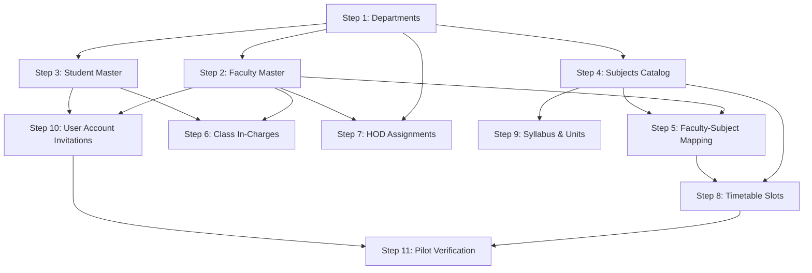

# HIET DIGITAL CAMPUS — REAL COLLEGE DATA ONBOARDING GUIDE
**Himachal Institute of Engineering & Technology, Shahpur**  
**Document Version:** 1.0.0 (Production Release)  
**Classification:** Confidential — Principal / System Administrator Operational Guide

---

## 1. Executive Overview

The HIET Digital Campus platform utilizes a staged, secure master data onboarding pipeline to transition from initial development demo data to live institutional records. This architecture protects:

- **Authentication & User Identity:** Zero plaintext password handling. Account invitations are dispatched via Supabase Auth Admin API links.
- **Relational Integrity:** Foreign keys and cascading constraints are enforced server-side.
- **Multi-Role Governance:** Preserves Faculty + HOD multi-tenancy. Appointing an HOD does not overwrite underlying teaching credentials.
- **Data Privacy & RLS:** FERPA/DPDP-compliant data isolation with Row Level Security (RLS) policies.
- **Zero Partial Import:** All imports are executed inside PostgreSQL atomic transactions (`process_master_import_atomic`). If even one required row violates constraints, the entire batch is rolled back automatically.

---

## 2. Recommended Pilot Cohort

Do not attempt a simultaneous institution-wide cutover. Always start with a controlled **Pilot Cohort**:

| Parameter | Recommended Pilot Specification |
| :--- | :--- |
| **Department** | Computer Science & Engineering (`CSE`) |
| **Semester** | Semester 6 |
| **Section** | Section A |
| **Students** | 10–20 Students |
| **Faculty** | 3–5 Faculty Members |
| **Subjects** | 4–5 Core Theory & Practical Subjects |
| **Class In-Charge** | 1 Designated Faculty In-Charge |
| **HOD** | 1 Department Head (`FAC-001`) |

### Why Pilot First?
1. Verifies geofenced classroom attendance coordinates with real faculty and student devices.
2. Validates timetable conflict rejection algorithms on active schedules.
3. Tests email delivery rates for auth invitations across institutional and personal domains.
4. Allows immediate, risk-free rollbacks without affecting non-pilot departments.

---

## 3. Strict 11-Step Import Sequence

Importing in the exact sequence is mandatory to satisfy database foreign keys:



### Step 1: Create Departments (`departments`)
- Registers department codes (`CSE`, `ECE`, `ME`, `CE`, `AS&H`).
- **Prerequisite for:** Faculty, Students, Subjects, HOD assignments.

### Step 2: Import Faculty Master (`faculty`)
- Onboards verified teacher records with unique employee codes (`FAC-001`), official designations, and department codes.
- **Prerequisite for:** Subject mappings, timetable, class in-charges, HODs.

### Step 3: Import Student Master (`students`)
- Enrolls students with unique university roll numbers (`22CSE001`), full names, semesters, and sections.
- **Prerequisite for:** Attendance, marks, class in-charges, student invitations.

### Step 4: Import Subjects (`subjects`)
- Defines subject codes (`CS-601`), credits, semesters, and course types (Theory, Lab).
- **Prerequisite for:** Timetable, faculty mappings, marks, syllabus.

### Step 5: Map Faculty to Subjects (`teacher_subjects`)
- Binds verified faculty members to semester course offerings and sections.

### Step 6: Assign Class In-Charges (`class_incharge`)
- Designates one primary faculty in-charge per department, semester, section, and academic year.

### Step 7: Assign HODs (`hod_assignment`)
- Appoints department heads with effective dates.
- Maintains multi-role integrity: updates `teachers_master.is_hod = true` and assigns role `hod` in `user_roles` while retaining role `teacher`.

### Step 8: Import Timetable (`timetable`)
- Schedules weekly class slots with start/end times, room codes, room GPS coordinates, and geofence radius.
- Rejects time and room collisions.

### Step 9: Import Syllabus (`syllabus`)
- Configures course syllabus units, learning outcomes, and references.

### Step 10: User Account Invitations (`user_invitations`)
- Dispatches activation invitations via the secure Edge Function `invite-real-users`.
- Maps Auth UID → Public User Profile → Master Student/Teacher records.
- Plaintext passwords are NEVER uploaded or stored.

### Step 11: Run Pilot Verification
- Principal tests pilot student login, timetable view, faculty attendance marking, and leave requests.

---

## 4. Staged Multi-Phase Import Workflow

Every master data import follows an 8-stage verification pipeline:

1. **Upload:** User uploads CSV or XLSX file. Client validates file signature, size limit (5MB), and encoding.
2. **Column Mapping:** Checks header aliases against required schema definitions.
3. **Validation:** Checks intra-file uniqueness, foreign keys against cached masters, format patterns, and bounds.
4. **Error Report:** If any row fails, generates a downloadable CSV error report detailing: `Row Number`, `Column`, `Invalid Value`, `Reason`, `Suggested Correction`.
5. **Preview:** Interactive 50-row preview with status badges (`Valid`, `Duplicate`, `Invalid`).
6. **Dry Run:** Invokes server function with `p_dry_run = true`. Simulates database constraints and returns `confirmation_token`. Zero database writes occur.
7. **Explicit Confirmation:** Modal prompts administrator to verify parameters and accept the safety agreement.
8. **Atomic Server-Side Import:** Executes transactional import via `process-master-import` / `process_master_import_atomic`.
9. **Audit Log & Summary:** Logs job details to `public.audit_logs` and `public.import_jobs`.

---

## 5. Security & Authentication Architecture

### Zero Plaintext Passwords Policy
- Passwords must **NEVER** be collected, imported, or stored in spreadsheets.
- The `invite-real-users` Edge Function invokes `supabase.auth.admin.inviteUserByEmail()`.
- Users receive a secure, time-limited cryptographic activation link to set their own confidential passwords.

### Profile Linkage Flow
```text
auth.users.id
   │
   ▼
public.users.supabase_auth_id
   │
   ├────────► public.user_roles (user_id = public.users.id, role = 'student' | 'teacher' | 'hod')
   │
   ├────────► public.students_master (user_id = public.users.id, matched on roll_no)
   │
   └────────► public.teachers_master (user_id = public.users.id, matched on faculty_id)
```

---

## 6. Demo Data Protection & Archival

Before importing live data, existing demo records must not be deleted blindly:

1. **Navigate to:** `Admin Console` → `Import College Data` → `Demo Data` button.
2. **Export Demo Backup:** Download JSON archive (`hiet_demo_data_backup_YYYY-MM-DD.json`).
3. **Disable Demo Accounts:** Flags demo users as `disabled` to prevent unauthorized logins during the transition.
4. **Archive Demo Records:** Calls `public.archive_demo_records()` to snapshot mock records into archival tables.
5. **Production Mode:** In `VITE_APP_ENV=production`, demo tools, test panels, and demo seeds are automatically hidden and permanently disabled.

---

## 7. Rollback & Disaster Recovery

If an import job fails or data requires rollback:

### Automatic Transactional Rollback
- The PostgreSQL function `process_master_import_atomic` wraps all insertions in an explicit transaction block.
- Any unhandled constraint failure or duplicate key exception raises an error, immediately reverting all insertions made by that job.
- The job status is recorded as `rolled_back`.

### Manual Recovery / Local State Reversion
- In-memory state maintains pre-import snapshots (`dataStore.getEntitySnapshot(entity)`).
- If execution encounters an exception, `dataStore.restoreEntitySnapshot(entity, snapshot)` restores pristine state instantly.

---

## 8. Student & Faculty Privacy Recommendations (DPDP / FERPA)

1. **Consent Protocol:** Ensure institutional consent forms are obtained prior to uploading student phone numbers and photos.
2. **Least Privilege Access:** Students can view only their personal academic and attendance records. Faculty can access only assigned section data.
3. **Audit Visibility:** All bulk modifications are audited with administrator email, timestamp, and row counts.
